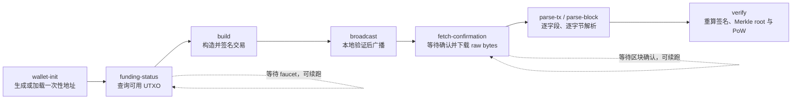
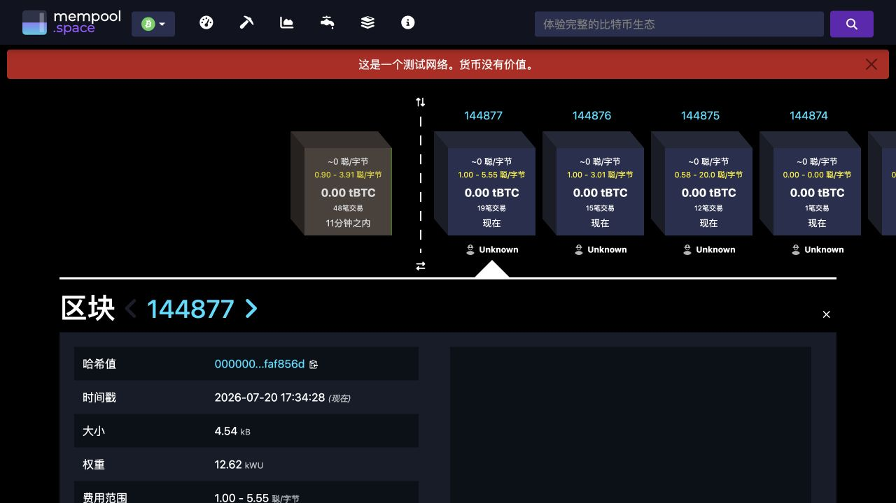
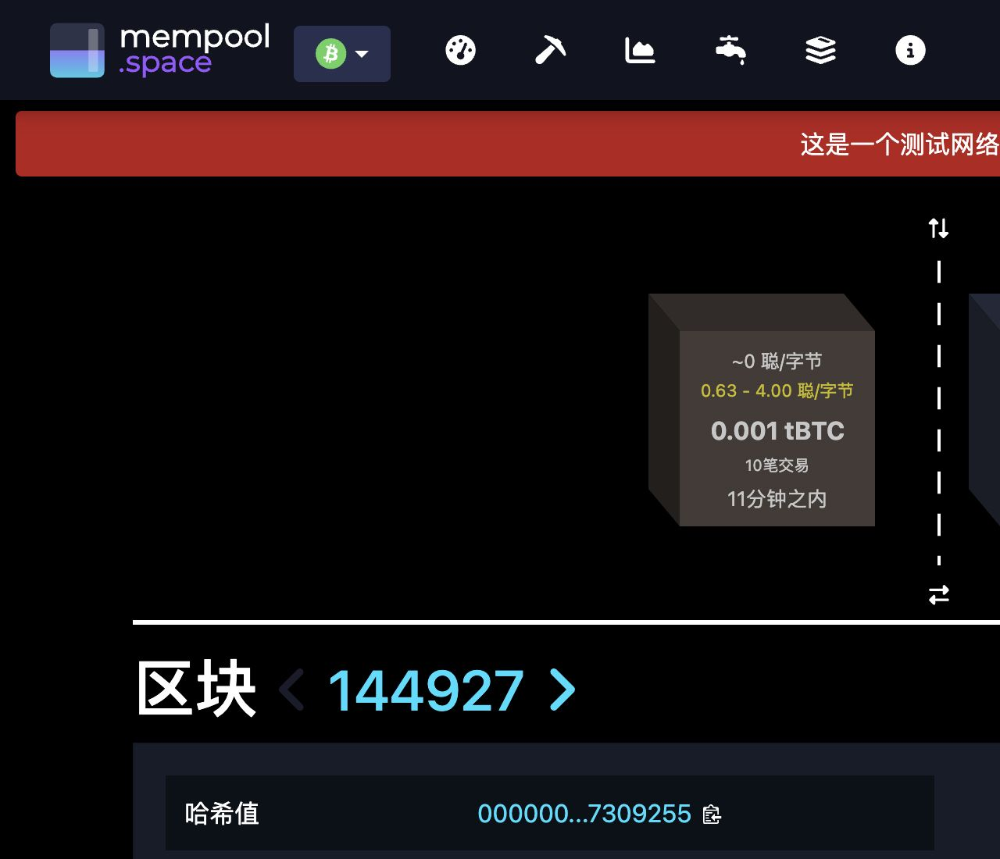
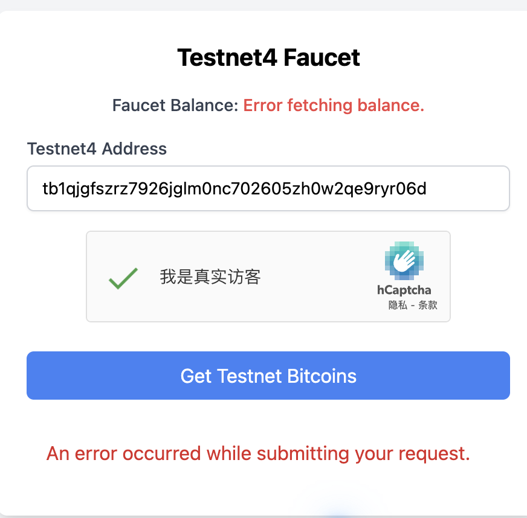
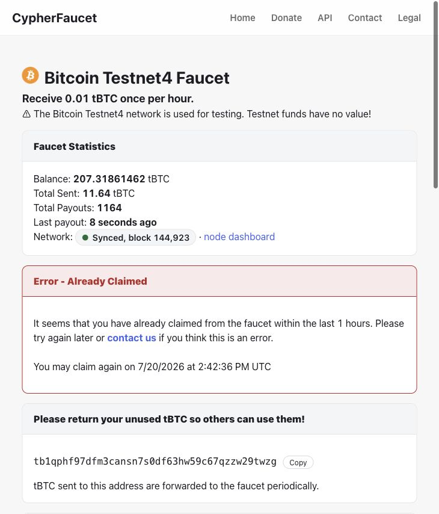
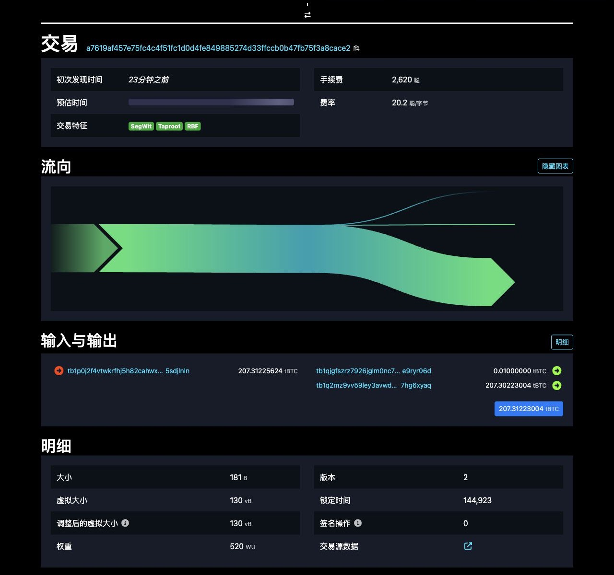
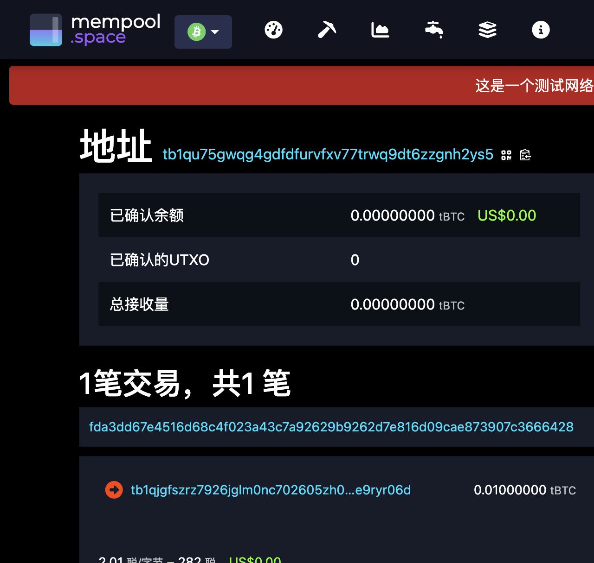
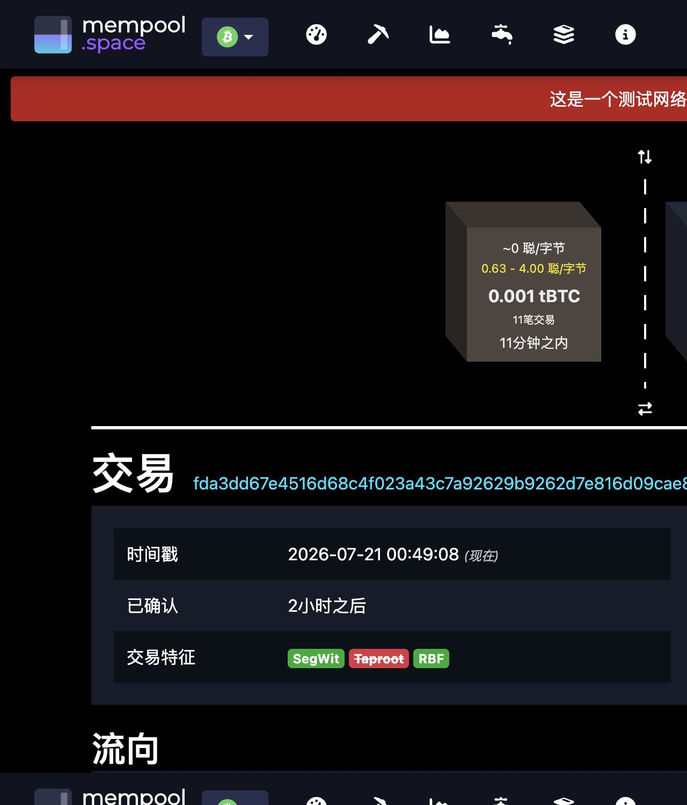
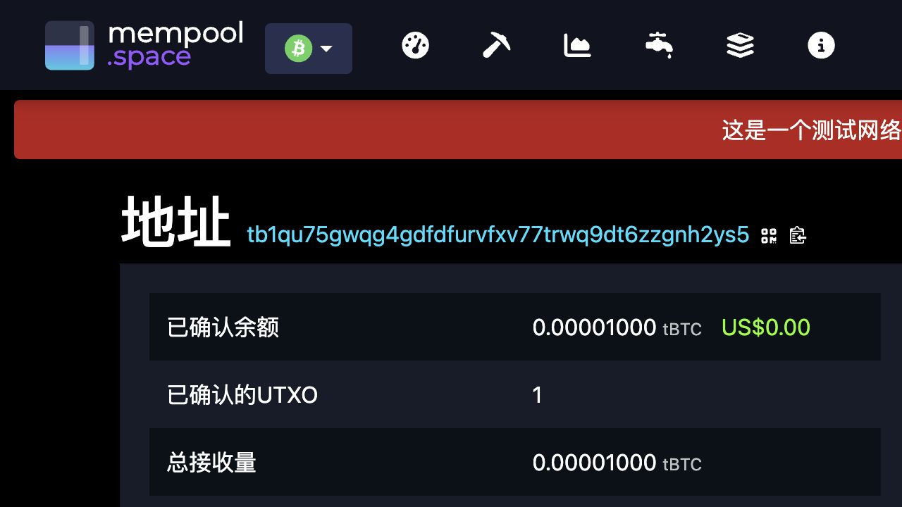

# Bitcoin Testnet4 交易构造与完整区块逐字节解析

> 课程实验报告（真实链上交易与完整区块验证版）

**作者：** Bitcoin 实验一  
**日期：** 2026 年 7 月 20 日

## 摘要

本实验实现了一个不依赖本地全节点的 Bitcoin Testnet4 实验工具：本地生成一次性 secp256k1 密钥，手工构造并签名原生 SegWit P2WPKH 交易，通过 Esplora API 查询 UTXO、广播和下载完整区块，并将交易与区块的每一个字节映射到字段、端序、8-bit 表示和语义。真实实验交易 `fda3dd67e4516d68c4f023a43c7a92629b9262d7e816d09cae873907c3666428` 已确认在高度 144927；本地重算的 BIP143 摘要、ECDSA 签名、TXID、WTXID 与金额守恒全部通过。包含该交易的区块共 88,989 bytes、29 笔交易，解析器生成 88,989 条无缺口覆盖记录，并独立验证 block hash、Merkle root 与 Proof of Work。报告同时保留 faucet 失败、成功领取、待确认和最终确认截图，使过程与最终结果均可复查。

**关键词：** Bitcoin；Testnet4；P2WPKH；BIP143；SegWit；区块序列化；Bitcoin Script

## 目录

1. [实验目标与完成状态](#实验目标与完成状态)
2. [实验环境与安全设计](#实验环境与安全设计)
3. [序列化规范与实现不变量](#序列化规范与实现不变量)
4. [交易构造与签名方法](#交易构造与签名方法)
5. [技术实现流程与关键代码](#技术实现流程与关键代码)
6. [真实实验交易结果](#真实实验交易结果)
7. [逐字节解析器](#逐字节解析器)
8. [先验公开区块解析结果](#先验公开区块解析结果)
9. [包含实验交易的最终确认区块](#包含实验交易的最终确认区块)
10. [Faucet 与广播过程记录](#faucet-与广播过程记录)
11. [测试、限制与结论](#测试限制与结论)
12. [参考文献](#参考文献)

---

## 实验目标与完成状态

实验目标包括真实测试网交易、交易逐字段解析、完整区块解析、locking/unlocking data 分析以及 PoW 计算。当前结果如表 <a href="#tab:status" data-reference-type="ref" data-reference="tab:status">1</a>。

<div id="tab:status">

| 项目               | 状态 | 证据                                        |
|:-------------------|:-----|:--------------------------------------------|
| Python 手写解析器  | 完成 | 17 个单元测试全部通过                       |
| 双地址一次性钱包   | 完成 | 私钥文件权限为 0600，公开地址单独保存       |
| 真实完整区块解析   | 完成 | 最终区块高度 144927，88,989 字节，29 笔交易 |
| Merkle root 与 PoW | 完成 | 本地计算均为 true                           |
| 自建交易签名逻辑   | 完成 | BIP143、DER、low-S、TXID/WTXID 均有测试     |
| 自建交易广播与确认 | 完成 | 高度 144927，交易、Merkle、PoW 全部验证通过 |

实验完成状态

</div>

## 实验环境与安全设计

<div id="tab:task1-environment">

| 项目 | 配置 |
|:---|:---|
| 硬件 | MacBook Pro（Mac14,9），Apple M2 Pro 10-core，16 GB memory |
| 操作系统 | macOS 15.6.1，ARM64 |
| Python | CPython 3.13.3 |
| 密码学实现 | `coincurve 21.0.0`，底层使用 `libsecp256k1` |
| 区块链网络 | Bitcoin Testnet4，native SegWit P2WPKH |
| 公共数据接口 | mempool.space Testnet4 Esplora API：<https://mempool.space/testnet4/api> |
| 测试工具 | pytest 8.4.2，共 17 个单元测试 |
| 报告工具 | XeLaTeX、`ctexart`、`latexmk`、Poppler |

任务一本机实验环境

</div>

发送地址与接收地址均为本实验新建的一次性 native SegWit 地址：

- **Sender：** `tb1qjgfszrz7926jglm0nc702605zh0w2qe9ryr06d`
- **Receiver：** `tb1qu75gwqg4gdfdfurvfxv77trwq9dt6zzgnh2ys5`

私钥仅写入被忽略的 `.secrets/testnet4_wallet.json`，报告、截图、CSV 与 JSON 均不含私钥。脚本重复执行 `wallet-init` 时只读取既有钱包，不覆盖密钥。

### 数据来源、信任边界与可复查产物

实验把网络接口看作“原始数据运输层”，而不是最终正确性的裁判。Esplora 提供地址 UTXO、广播入口、确认状态以及 raw transaction/block bytes；一旦原始字节下载完成，TXID、WTXID、手续费、区块哈希、Merkle root、PoW 和 witness commitment 均由本地代码重新计算。这样即使 explorer 的展示字段发生格式变化，核心结论仍可从保存的 raw bytes 复现。各层责任如表 <a href="#tab:task1-trust-boundary" data-reference-type="ref" data-reference="tab:task1-trust-boundary">3</a>。

<div id="tab:task1-trust-boundary">

| 层次 | 负责内容 | 本地采取的复核 |
|:---|:---|:---|
| Faucet | 向公开 sender 地址发送 Testnet4 UTXO | 只接受链上已确认且金额足够的 UTXO，不接收任何私钥 |
| Esplora API | UTXO 查询、广播、状态与 raw bytes 下载 | 广播返回 TXID 必须等于本地 TXID；确认交易必须能在 raw block 中找到 |
| 本地密码学层 | BIP143 digest、ECDSA、DER/low-S | 从 witness 重新取签名和公钥，重建摘要后独立验证 |
| 本地解析层 | 交易、区块、Script 与逐字节记录 | 游标必须消费到文件末尾，覆盖记录不得缺失或重叠 |
| 报告层 | 表格、截图和代表性 hexdump | 数字来自 JSON/CSV；截图只作为过程证据，不代替字节级证明 |

Task 1 的数据来源与信任边界

</div>

持久化文件也按敏感性分离：`data/wallet_public.json` 只含地址、公钥和 scriptPubKey；`data/transaction_draft.json` 保存可公开的 unsigned/signed transaction 结构和 raw hex；`data/broadcast.json`、`data/confirmation.json` 保存链上状态；`output/data` 保存解析结果与逐字节 CSV。唯一含私钥的秘密文件位于 `.secrets`，权限检查结果为 0600，并由版本控制忽略。

## 序列化规范与实现不变量

Bitcoin 的线格式并不是把一个 JSON 对象直接编码，而是由定长整数、CompactSize、定长哈希和变长字节串依次拼接。解析器必须同时处理“线上的字节顺序”和 explorer 面向人的展示顺序；如果二者混用，即使字段看起来正确，TXID、block hash 与 Merkle root 也会全部错误。表 <a href="#tab:serialization-rules" data-reference-type="ref" data-reference="tab:serialization-rules">4</a> 汇总了本实验实际使用的编码规则。

<div id="tab:serialization-rules">

| 数据类型 | 线格式 | 本实验的处理 |
|:---|:---|:---|
| 定长整数 | version、vout、amount、sequence、locktime 等使用 little-endian | 先保留原始十六进制，再按字段宽度解码为整数 |
| 32-byte hash | outpoint 中以前一交易哈希的内部字节序保存 | 显示 TXID/block hash 时翻转 32 bytes；参与哈希时使用规范序列化字节 |
| CompactSize | $0\ldots252$ 直接编码；之后用 `fd`/`fe`/`ff` 加 2/4/8-byte little-endian | 检查截断与 non-canonical encoding，并覆盖 252/253、65,535/65,536 边界 |
| 变长字节串 | CompactSize 长度后紧跟指定数量字节 | scriptSig、scriptPubKey 和 witness item 均先读取长度，再进行边界检查 |
| SegWit 标志 | version 后出现 `00 01` | marker/flag 属于完整序列化，但不属于 stripped serialization |

交易与区块解析使用的基础序列化规则

</div>

对同一笔 SegWit 交易，完整序列化记为 $S_{\mathrm{full}}$，删除 marker、flag 与 witness 后的传统序列化记为 $S_{\mathrm{base}}$。本实验按 Bitcoin 的展示约定计算 $$\begin{align*}
 \mathrm{TXID}  &= \operatorname{reverse}\!\left(\operatorname{SHA256d}(S_{\mathrm{base}})\right),\\
 \mathrm{WTXID} &= \operatorname{reverse}\!\left(\operatorname{SHA256d}(S_{\mathrm{full}})\right).
\end{align*}$$ 本次交易的 base size 为 113 bytes，witness serialization（含 marker/flag）为 110 bytes，因此 $$\mathrm{weight}=4\times113+110=562\ \mathrm{WU},\qquad
 \mathrm{vsize}=\left\lceil\frac{562}{4}\right\rceil=141\ \mathrm{vB}.$$ 这也解释了为什么同一笔交易的 TXID 与 WTXID 不同，以及为什么手续费率按 vB 而非原始 223 bytes 计价。

解析器把游标单调前移作为核心不变量：每次读取都必须先证明剩余长度足够；每个半开区间 $[\textit{offset\_start},\textit{offset\_end})$ 只能被一个字段消费；解析结束时游标必须恰好等于输入长度。逐字节 CSV 是这些不变量的外部证明，而不是解析完成后的附加格式化结果。

### 端序和 CompactSize 的具体工作示例

以 faucet UTXO 的展示 TXID $$\texttt{a7619af457e75fc4c4f51fc1d0d4fe849885274d33ffccb0b47fb75f3a8cace2}$$ 为例，outpoint 在线格式中保存为反序的 32 bytes：

``` 
e2ac8c3a5fb77fb4b0ccff334d278598
84fed4d0c11ff5c4c45fe757f49a61a7
```

解析时先保留这 32 bytes 的原始顺序，再翻转后输出人类习惯的 TXID。类似地，金额 1,000 sats 编码为 `e803000000000000`，找零 998,718 sats 编码为 `3e3d0f0000000000`；它们都是 8-byte little-endian，而不是十六进制字符串的文本反转。

本交易的输入数、输出数和脚本长度都小于 253，因此 CompactSize 各占一个 byte。例如 `02` 表示两个输出，`16` 表示十进制 22-byte P2WPKH scriptPubKey。完整区块的 29 笔交易同样用单字节 `1d` 表示。若数值为 253，则必须写成 `fd fd00`；直接写 `fd` 后接更小数值会构成 non-canonical encoding，解析器明确拒绝。该检查避免“同一逻辑值存在多种线格式”给上层哈希与长度判断带来歧义。

## 交易构造与签名方法

### P2WPKH 输出与地址

压缩公钥 $P$ 先计算 $$h=\operatorname{RIPEMD160}(\operatorname{SHA256}(P)),$$ 输出脚本为 `00 14 <20-byte h>`，地址使用 Testnet4 的 `tb` HRP 进行 Bech32 编码。实验交易固定为 version 2、一个输入、付款与找零两个 P2WPKH 输出、`sequence=0xfffffffd`（opt-in RBF）和 `locktime=0`。

### BIP143 摘要

对输入 $i$，实现的 SegWit v0 签名预映像为 $$\begin{align*}
&nVersion \parallel hashPrevouts \parallel hashSequence \parallel outpoint_i\\
&\parallel scriptCode_i \parallel value_i \parallel sequence_i\\
&\parallel hashOutputs \parallel nLockTime \parallel sighashType.
\end{align*}$$ 最终摘要是该预映像的 double-SHA256。P2WPKH 的 `scriptCode` 还原为传统 P2PKH 形式 $$\texttt{76 a9 14 <HASH160(pubkey)> 88 ac}.$$ 其中三个聚合哈希分别为 $$\begin{align*}
 hashPrevouts &= \operatorname{SHA256d}(outpoint_0\parallel\cdots\parallel outpoint_{n-1}),\\
 hashSequence &= \operatorname{SHA256d}(sequence_0\parallel\cdots\parallel sequence_{n-1}),\\
 hashOutputs  &= \operatorname{SHA256d}(output_0\parallel\cdots\parallel output_{m-1}).
\end{align*}$$ `SIGHASH_ALL` 把全部输入 outpoint、全部 sequence 和全部输出承诺进摘要；当前输入的 outpoint、`scriptCode` 与 UTXO 金额则显式出现在预映像中。SegWit v0 把被花费金额纳入摘要，使离线签名器无需获取整笔前序交易也能检测被替换的输入金额。对本实验数据重建出的摘要为 $$\texttt{e2c574443348d600e3e03aaabd23ea731fdde9a580f3a07a32aeb96e1f9c338c}.$$

签名采用 ECDSA、DER 编码、low-S 规范化并在末尾附加 `01`（`SIGHASH_ALL`）。native P2WPKH 输入的 `scriptSig` 为空；真正的 unlocking data 是 witness 中的签名与压缩公钥，而 witness item 本身不是一段需要逐 opcode 执行的 Script。

### ECDSA、DER 与 low-S 的实证检查

令 secp256k1 基点为 $G$、阶为 $n$、公钥为 $P=dG$，摘要解释为标量 $e$。验证端计算 $$w=s^{-1}\bmod n,\qquad u_1=ew\bmod n,\qquad u_2=rw\bmod n,$$ 再检查点 $R'=u_1G+u_2P$ 的横坐标是否满足 $x(R')\bmod n=r$。本实验没有把库返回的“验证成功”当作唯一证据：程序从 witness 取出 DER、分离最后一个 sighash byte、重新计算 $e$，再使用 witness 中的压缩公钥执行上述验证。

本次 witness 公钥为

``` 
021c2a98e839fb46a75c19528a8e7466c41ffa4639ac3db717963c8355d3a7dec8
```

签名中两个 DER 整数为 $$\begin{align*}
r&=\texttt{af0175f0222620ee9264406ccaccdbe1277442e3247808dcd697dcdfb29d9478},\\
s&=\texttt{25a183f8a647ac59ee66a4409a6756c80f1467a50be2f11048fef9f71a1f4f8b}.
\end{align*}$$ DER 外的末字节 `01` 表示 `SIGHASH_ALL`。$s$ 已满足 $1\le s\le n/2$；low-S 把数学上同样有效的 $(r,n-s)$ 排除，减少仅改变签名编码而不改变支付语义的可塑性。DER 中 $r$ 的最高位为 1，因而编码前有一个 `00` 正号字节；解析器按 ASN.1 INTEGER 规则验证该字节是否必要，并拒绝多余前导零、负数和长度不一致。

### 金额与费用

默认付款 1,000 sats，费率 2 sat/vB。脚本选择一个已确认 UTXO，并计算 $$\text{change}=\text{input}-\text{payment}-\lceil 2\times vsize\rceil.$$ 若付款或找零低于保守 dust threshold 294 sats，程序在签名前拒绝构造。广播前再次验证签名、摘要、金额守恒、TXID 和 WTXID。

### UTXO 选择、手续费估计与 RBF 语义

`build` 首先过滤 `confirmed=true` 的 UTXO，再选择金额最大的一个，以保证本实验的一输入结构并减少手续费估计变量。程序在签名前按预期的 141 vB 计算手续费；签名后再从 stripped/full serialization 计算实际 weight 与 vsize。本次 DER 签名为 71 bytes、附加 sighash byte 后 witness item 为 72 bytes，实际仍为 141 vB，因此 282 sats 恰好对应 2 sat/vB。若 DER 长度或交易结构改变，报告不能只沿用预估值，而必须使用最终序列化重新计算的 vsize 检查实际费率。

`sequence=0xfffffffd` 同时小于 `0xfffffffe`，表示 opt-in RBF，又不会启用相对时间锁语义。需要提高费率时，`--replace-draft` 明确复用原 outpoint，重新计算找零、摘要、签名、TXID 与 WTXID；它不会在地址上随意选择另一个 UTXO。旧交易与替代交易互相冲突，最终只能有一个进入有效区块。这一设计把“加速未确认交易”与“重复花费已确认交易”区分开来。

``` numberLines

def build_and_sign_p2wpkh(
    *,
    private_key: bytes,
    public_key: bytes,
    utxo: dict[str, Any],
    receiver_script: bytes,
    change_script: bytes,
    payment_sats: int = 1000,
    fee_rate: float = 2.0,
) -> dict[str, Any]:
    from coincurve import PrivateKey

    if payment_sats < 294:
        raise ValueError("payment output is below the conservative P2WPKH dust threshold")
    input_value = int(utxo["value"])
    estimated_vsize = 141
    fee_sats = math.ceil(estimated_vsize * fee_rate)
    change_sats = input_value - payment_sats - fee_sats
    if change_sats < 294:
        raise ValueError(
            f"insufficient UTXO: need payment {payment_sats} + fee {fee_sats} + change >= 294, got {input_value}"
        )
    tx: dict[str, Any] = {
        "version": 2,
        "has_witness": True,
        "inputs": [
            {
                "prev_txid": utxo["txid"],
                "prev_vout": int(utxo["vout"]),
                "script_sig": "",
```

## 技术实现流程与关键代码

### 命令行状态流与安全广播

工具把实验拆成 $$\texttt{wallet-init}\rightarrow\texttt{funding-status}\rightarrow
\texttt{build}\rightarrow\texttt{broadcast}\rightarrow
\texttt{fetch-confirmation}\rightarrow\texttt{verify}$$ 六个可续跑阶段，并额外提供独立的 `parse-tx` 与 `parse-block`。每个命令只读取前一阶段已写入的 JSON 状态，成功后再写入自己的结果文件，因此 faucet 等待、交易确认等待或程序退出都不要求从头生成钱包。重复执行 `wallet-init` 会加载既有钱包；`build --replace-draft` 才会显式复用原输入创建 RBF 替代草稿。

广播并不是把 `raw_hex` 直接交给 API。清单 <a href="#lst:task1-broadcast" data-reference-type="ref" data-reference="lst:task1-broadcast">[lst:task1-broadcast]</a> 展示了实际的 fail-closed 流程：先重建签名摘要、验证 ECDSA、TXID/WTXID 与金额守恒；任何检查失败都拒绝广播。API 返回的 TXID 还必须与本地 TXID 相同，否则不保存“广播成功”状态。

``` numberLines
def command_broadcast(args: argparse.Namespace) -> None:
    draft = read_json(DRAFT_PATH)
    checks = verify_p2wpkh_draft(draft)
    if not all(value for key, value in checks.items() if key != "calculated_sighash"):
        raise RuntimeError(f"refusing broadcast: local verification failed: {checks}")
    returned_txid = client_from_args(args).broadcast(draft["raw_hex"])
    if returned_txid != draft["txid"]:
        raise RuntimeError(f"API returned unexpected txid {returned_txid}, expected {draft['txid']}")
    result = {"network": "testnet4", "txid": returned_txid, "local_verification": checks}
    write_json(BROADCAST_PATH, result)
    print_json(result)
```

确认阶段以同一 TXID 查询 status；只有 `confirmed=true` 才下载确认交易与完整区块的 raw bytes，并调用与手工解析命令完全相同的解析函数。清单 <a href="#lst:task1-confirmation" data-reference-type="ref" data-reference="lst:task1-confirmation">[lst:task1-confirmation]</a> 中的四个布尔量把“API 称已确认”进一步收紧为：交易字节的 TXID 匹配、交易确实存在于区块交易数组、Merkle root 正确且 header 满足 PoW。

``` numberLines
def command_fetch_confirmation(args: argparse.Namespace) -> None:
    draft = read_json(DRAFT_PATH)
    client = client_from_args(args)
    status = client.transaction_status(draft["txid"])
    result: dict[str, Any] = {"txid": draft["txid"], "status": status}
    if status.get("confirmed"):
        block_hash = status["block_hash"]
        tx_hex = client.transaction_hex(draft["txid"])
        block_raw = client.block_raw(block_hash)
        RAW_DIR.mkdir(parents=True, exist_ok=True)
        (RAW_DIR / "transaction.hex").write_text(tx_hex + "\n", encoding="ascii")
        (RAW_DIR / "block.hex").write_text(block_raw.hex() + "\n", encoding="ascii")
        transaction = save_transaction_analysis(bytes.fromhex(tx_hex), "confirmed_transaction")
        block = save_block_analysis(block_raw, "confirmed_block")
        result.update(
            {
                "block_hash": block_hash,
                "block_height": status.get("block_height"),
                "transaction_match": transaction["txid"] == draft["txid"],
                "transaction_in_block": draft["txid"] in [tx["txid"] for tx in block["transactions"]],
                "block_merkle_valid": block["merkle_root_valid"],
                "block_pow_valid": block["header"]["pow_valid"],
            }
        )
```



*图：Task 1 的可续跑状态流。链上等待阶段与本地解析、验证阶段通过持久化 JSON 解耦。*

### BIP143 预映像与 witness 组装

清单 <a href="#lst:task1-bip143" data-reference-type="ref" data-reference="lst:task1-bip143">[lst:task1-bip143]</a> 是报告前述公式的直接实现。所有整数都显式指定 little-endian；outpoint 的 TXID 在进入线格式前翻转；scriptCode 使用 CompactSize 长度前缀；输入金额以 8 bytes 写入。函数最终只返回 32-byte double-SHA256，而不是把人类可读 TXID 字符串误作哈希输入。

``` numberLines
def bip143_sighash(tx: dict[str, Any], input_index: int, script_code: bytes, input_value: int) -> bytes:
    if not 0 <= input_index < len(tx["inputs"]):
        raise IndexError("input index out of range")
    prevouts = b"".join(
        bytes.fromhex(txin["prev_txid"])[::-1] + int(txin["prev_vout"]).to_bytes(4, "little")
        for txin in tx["inputs"]
    )
    sequences = b"".join(int(txin["sequence"]).to_bytes(4, "little") for txin in tx["inputs"])
    serialized_outputs = bytearray()
    for output in tx["outputs"]:
        script = bytes.fromhex(output["script_pubkey"])
        serialized_outputs.extend(int(output["value_sats"]).to_bytes(8, "little"))
        serialized_outputs.extend(encode_compact_size(len(script)))
        serialized_outputs.extend(script)
    current = tx["inputs"][input_index]
    preimage = bytearray()
    preimage.extend(int(tx["version"]).to_bytes(4, "little", signed=True))
    preimage.extend(sha256d(prevouts))
    preimage.extend(sha256d(sequences))
    preimage.extend(bytes.fromhex(current["prev_txid"])[::-1])
    preimage.extend(int(current["prev_vout"]).to_bytes(4, "little"))
    preimage.extend(encode_compact_size(len(script_code)))
    preimage.extend(script_code)
    preimage.extend(int(input_value).to_bytes(8, "little"))
    preimage.extend(int(current["sequence"]).to_bytes(4, "little"))
    preimage.extend(sha256d(bytes(serialized_outputs)))
    preimage.extend(int(tx["locktime"]).to_bytes(4, "little"))
    preimage.extend(SIGHASH_ALL.to_bytes(4, "little"))
    return sha256d(bytes(preimage))
```

得到 digest 后，`coincurve` 只负责 secp256k1 ECDSA 原语；交易结构、scriptCode、sighash type 和 witness serialization 均由本项目负责。清单 <a href="#lst:task1-signing" data-reference-type="ref" data-reference="lst:task1-signing">[lst:task1-signing]</a> 中 `hasher=None` 表示库直接签署已经计算好的 BIP143 digest，避免再次 SHA256；DER 末尾附加的 `01` 不属于 DER，而是 Bitcoin witness 中的 sighash type。

``` numberLines
    pubkey_hash = hash160(public_key)
    if change_script != p2wpkh_script(public_key):
        raise ValueError("change script does not match sender public key")
    digest = bip143_sighash(tx, 0, p2pkh_script(pubkey_hash), input_value)
    signature_der = PrivateKey(private_key).sign(digest, hasher=None)
    signature_with_type = signature_der + bytes([SIGHASH_ALL])
    tx["witnesses"] = [[signature_with_type.hex(), public_key.hex()]]
    full = serialize_transaction(tx, include_witness=True)
    stripped = serialize_transaction(tx, include_witness=False)
    weight = len(stripped) * 4 + len(full) - len(stripped)
    vsize = math.ceil(weight / 4)
```

### 逐字节游标与完整覆盖

解析器没有在解析结束后再按字段长度“猜测”offset，而是让所有字段都通过同一个 `ByteReader.read` 消费。清单 <a href="#lst:task1-bytereader" data-reference-type="ref" data-reference="lst:task1-bytereader">[lst:task1-bytereader]</a> 中每消费一个 byte 就立即生成一个 `ByteRecord`，记录半开区间、十六进制、8-bit 二进制、字段路径、解码值、端序和备注；越界在记录产生前抛出 `ParseError`。

``` numberLines
    def read(
        self,
        n: int,
        field_path: str,
        *,
        decoded_value: Any = "",
        endian: str = "",
        notes: str = "",
    ) -> bytes:
        if n < 0 or self.pos + n > len(self.data):
            raise ParseError(f"need {n} bytes for {field_path} at offset {self.pos}, only {self.remaining()} remain")
        start = self.pos
        chunk = self.data[start : start + n]
        decoded = str(decoded_value)
        for i, value in enumerate(chunk):
            self.records.append(
                ByteRecord(
                    offset_start=start + i,
                    offset_end=start + i + 1,
                    raw_hex=f"{value:02x}",
                    bits=f"{value:08b}",
                    field_path=field_path,
                    decoded_value=decoded,
                    endian=endian,
                    notes=notes,
                )
            )
        self.pos += n
        return chunk
```

交易或区块解析结束后，覆盖断言函数再将实际 offset 序列与 `range(start,end)` 精确比较；缺失、重复和 trailing bytes 都会使命令失败。因此“every bit”结果来自解析路径本身，而不是仅比较 CSV 行数。该函数的完整实现位于 的 。

### 完整区块的验证闭环

区块解析复用同一交易解析器：读取 80-byte header 后，根据 CompactSize 数量逐笔调用 `_parse_transaction`，最后才允许游标到达文件末尾。清单 <a href="#lst:task1-block-core" data-reference-type="ref" data-reference="lst:task1-block-core">[lst:task1-block-core]</a> 展示了 block hash、compact target、PoW 整数比较、交易循环、覆盖断言与 Merkle root 重建的核心顺序。

``` numberLines
    header_end = reader.pos
    header = raw[header_start:header_end]
    header_digest = sha256d(header)
    block_hash = header_digest[::-1].hex()
    target = compact_target(bits)
    hash_integer = int.from_bytes(header_digest, "little")
    transaction_count = read_compact_size(reader, "block.transaction_count")
    transactions: list[dict[str, Any]] = []
    for index in range(transaction_count):
        transactions.append(_parse_transaction(reader, f"block.transactions[{index}]"))
    if reader.remaining() != 0:
        raise ParseError(f"{reader.remaining()} trailing bytes after declared block transactions")
    coverage = assert_complete_coverage(reader.records, 0, len(raw))
    txids = [transaction["txid"] for transaction in transactions]
    calculated_merkle = merkle_root_from_txids(txids)
```

随后程序从 coinbase input 的首个 data-push 解码 BIP34 height，并在 coinbase outputs 中匹配 `6a24aa21a9ed` witness commitment 前缀。最终 JSON 同时保存 header 声明值、本地计算值和布尔比较值，使报告中的 block hash、Merkle、PoW 和逐字节覆盖可以分别追溯。

## 真实实验交易结果

CypherFaucet 向 sender 注入 1,000,000 sats；入账交易 TXID 为 `a7619af457e75fc4c4f51fc1d0d4fe849885274d33ffccb0b47fb75f3a8cace2`， 其 vout 0 在高度 144925 确认。随后本地程序使用该 UTXO 构造、签名并广播实验交易。交易核心结果如下：

| 字段 | 结果 |
|:---|:---|
| TXID | `fda3dd67e4516d68c4f023a43c7a92629b9262d7e816d09cae873907c3666428` |
| WTXID | `dbebb2a01ab826570124b004a33d6da4a14f552dfbb29323a7520d7a9f1d1fba` |
| 输入 | 1,000,000 sats，faucet UTXO vout 0 |
| 付款输出 | 1,000 sats，发送至 receiver P2WPKH |
| 找零输出 | 998,718 sats，返回 sender P2WPKH |
| 手续费 / 费率 | 282 sats / 2.00 sat/vB（explorer 显示 2.01 sat/vB） |
| Size / base / weight / vsize | 223 B / 113 B / 562 WU / 141 vB |
| Version / sequence / locktime | 2 / `0xfffffffd` / 0 |
| scriptSig | 空（native P2WPKH） |
| Witness | 两项：DER+`SIGHASH_ALL` 签名、33-byte 压缩公钥 |
| BIP143 digest | `e2c574443348d600e3e03aaabd23ea731fdde9a580f3a07a32aeb96e1f9c338c` |
| 本地验证 | signature、sighash、TXID、WTXID、金额守恒全部为 true |
| Byte coverage | 223 records，complete=true |

交易输出金额满足 $$1{,}000{,}000 = 1{,}000 + 998{,}718 + 282.$$ 其中 marker/flag 为 `00 01`；输入的 `scriptSig` 长度为零，witness 单独序列化，因此 TXID 排除 witness，而 WTXID 包含 witness。CSV 中 223 条记录与 223 个原始字节一一对应。

从字节布局看，offset 0–3 是 version，4–5 是 marker/flag，offset 6 的 `01` 是输入数；唯一输入随后给出反序保存的前序 TXID、vout 0、长度为零的 scriptSig 与 `fdffffff` sequence。两个输出分别携带 1,000 和 998,718 sats，且 scriptPubKey 都是 22-byte 的 `00 14 <20-byte key hash>`。输出之后才出现 witness stack：计数 `02`、72-byte 签名项与 33-byte 压缩公钥项，最后四字节为 locktime。该顺序既能从 raw hex 单独恢复，也与生成的逐字节 JSON/CSV 一致。

### 实验交易的精确字节区间

表 <a href="#tab:task1-byte-layout" data-reference-type="ref" data-reference="tab:task1-byte-layout">5</a> 由 `generated_transaction_bytes.csv` 按连续 `field_path` 聚合而来。offset 使用左闭右开区间，因此长度恒等于 $\textit{end}-\textit{start}$；所有区间首尾相接，从 0 连续覆盖到 223。这个表比只展示 raw hex 更容易定位 marker/flag、空 scriptSig 和 witness 的实际位置。

<div id="tab:task1-byte-layout">

| Offset  | 字段               | 原始字节与解码                                  |
|:--------|:-------------------|:------------------------------------------------|
| Offset  | 字段               | 原始字节与解码                                  |
| 0–4     | version            | `02000000` $\rightarrow 2$                      |
| 4–6     | marker / flag      | `00 01`，启用 SegWit serialization              |
| 6–7     | input count        | `01` $\rightarrow 1$                            |
| 7–39    | previous TXID      | `e2ac8c3a…f49a61a7`，展示时整体翻转             |
| 39–43   | previous vout      | `00000000` $\rightarrow 0$                      |
| 43–44   | scriptSig length   | `00`；因此没有 scriptSig 数据区间               |
| 44–48   | sequence           | `fdffffff` $\rightarrow 0xfffffffd$             |
| 48–49   | output count       | `02` $\rightarrow 2$                            |
| 49–80   | payment output     | 8-byte 金额、`16` 长度、22-byte receiver P2WPKH |
| 80–111  | change output      | 8-byte 金额、`16` 长度、22-byte sender P2WPKH   |
| 111–112 | witness item count | `02` $\rightarrow 2$                            |
| 112–185 | signature item     | `48` 长度 + 72 bytes DER/`SIGHASH_ALL`          |
| 185–219 | public-key item    | `21` 长度 + 33-byte compressed public key       |
| 219–223 | locktime           | `00000000` $\rightarrow 0$                      |

223-byte 实验交易的字段级 offset 映射

</div>

需要注意，offset 43 的 `00` 既是一个真实占位字段，又说明接下来没有 unlocking Script bytes；不能把 witness 误接到该字段后立刻解析。解析器必须先完成全部 outputs，随后按每个 input 的顺序读取 witness stack。TXID 的 stripped serialization 则完全移除 offset 4–5 和 111–218，而不是仅把 witness 内容替换为空。

## 逐字节解析器

### 交易字段

解析顺序严格跟随 consensus serialization：version，SegWit marker/flag，CompactSize input count，inputs，output count，outputs，witnesses 和 locktime。每个被消费的字节产生一条记录：

``` 
offset_start, offset_end, raw_hex, bits,
field_path, decoded_value, endian, notes
```

覆盖断言要求 offset 恰好为 $0,1,\ldots,N-1$，不得有缺口或重复。CompactSize 特别测试 252/253、65,535/65,536 边界，并拒绝 non-canonical encoding。

### Script 处理范围

工具能识别 P2PKH、P2SH、P2WPKH、P2WSH、P2TR、OP_RETURN，解析直接 push、OP_PUSHDATA1/2/4，并保留未知 opcode。对本实验 P2WPKH 输入执行完整的摘要重建与 ECDSA 验证；对完整区块中的其他脚本做结构化反汇编，但不声称替代 Bitcoin Core 的完整共识 Script VM。

<div id="tab:script-patterns">

| 类型 | 典型 locking script / witness program | spending input 的主要数据 |
|:---|:---|:---|
| P2PKH | `OP_DUP OP_HASH160 <20B> OP_EQUALVERIFY OP_CHECKSIG` | scriptSig 中的签名与公钥 |
| P2SH | `OP_HASH160 <20B> OP_EQUAL` | scriptSig 最后一项为 redeemScript；具体参数位于其前 |
| P2WPKH | `OP_0 <20B keyhash>` | scriptSig 为空；witness 为签名、公钥 |
| P2WSH | `OP_0 <32B scripthash>` | witness 最后一项为 witnessScript |
| P2TR | `OP_1 <32B x-only key>` | witness 为 key-path 签名，或 script-path 参数、脚本与 control block |
| OP_RETURN | `OP_RETURN <data>` | 可证明不可花费，用于承载有限元数据 |

解析器覆盖的常见输出脚本与解锁数据位置

</div>

“反汇编”与“验证”在本报告中严格区分：前者把 opcode 和 data-push 边界恢复为结构化记录，未知 opcode 也不丢失；后者需要执行签名摘要规则与 Script 语义。本实验只对自身 P2WPKH 输入实现完整验证闭环，对区块内其他脚本不推断其历史执行上下文。

## 先验公开区块解析结果

本实验下载并解析区块高度 144877：

| 字段 | 结果 |
|:---|:---|
| Block hash | `0000000000e9ed9d48999d673d817cf089298e111083a71670cc7c6b4faf856d` |
| Previous block | `0000000000865d144d99fc51ed2ab39490e3eb144038c0ea7b5cd71ed7369dcf` |
| Merkle root | `0588d2c1047631a0859060c5ecfe9c6e46440f28f60bb7bbf3aaf12417b348f7` |
| Size / transactions | 4,537 bytes / 19 transactions |
| Bits / nonce | `1d00ffff` / 4,083,417,704 |
| Coinbase height | 144877（由 coinbase scriptSig 首个 push 解码） |
| Witness commitment | `6c4a8c9288478cb4dcd419245d0ef4f8901c75cbd55e7761fe3f51c05668c69b` |
| Byte coverage | 4,537 records，complete=true |
| Merkle / PoW | true / true |

80-byte header 原始十六进制为：

``` 
00801022 cf9d36d71ed75c7beac0384014ebe39094b32aed51fc994d145d860
00000000 f748b31724f1aaf3bbb70bf6280f44466e9cfeecc5609085a031760
4c1d2880 5a4eb5d6 ffff001d 680264f3
```

本地计算 $H=\operatorname{SHA256d}(header)$，按展示约定翻转后得到上述 block hash。\
由 `bits=0x1d00ffff` 得目标 $$T=\texttt{00000000ffff0000}\ldots\texttt{0000},$$ 且 $\operatorname{int}(H)\le T$。19 个 TXID 按区块顺序逐层 double-SHA256（奇数层复制末节点）得到与 header 相同的 Merkle root。

该较小区块用于在 faucet 到账前完成集成测试。最终验收则使用下面包含本实验交易的区块，解析流程完全相同。

## 包含实验交易的最终确认区块

实验交易确认于高度 144927，在区块交易数组中的 0-based index 为 7（即含 coinbase 在内的第 8 笔）。关键结果如下：

| 字段 | 结果 |
|:---|:---|
| Block hash | `0000000000000000bb15b540dec2b41e6d2ce74775a6c90c6eaf307377309255` |
| Previous block | `0000000000c7cc42a40e338d6b1f6eb3b6a8ff3d35c910094d403c3d6b0f903c` |
| Merkle root | `05a44f2cfa6f3903f74f1e9869019430b804dcc21167ea3b7209773e7dcf51ad` |
| Size / transactions | 88,989 bytes / 29 transactions |
| Bits / nonce | `190228f4` / 1,680,841,051 |
| Target | `000000000000000228f400000000000000000000000000000000000000000000` |
| Coinbase height | 144927（由 coinbase scriptSig 首个 push 解码） |
| Witness commitment | `18da3384b53405183de0b2aa1e19ebc349d6718a98cee96c365adc88e9502bfa` |
| 实验交易位置 | index 7，transaction_in_block=true |
| Byte coverage | 88,989 records，complete=true |
| Merkle / PoW | true / true |

80-byte header 原始十六进制为：

``` 
00401f25 3c900f6b3d3c404d0910c9353dffa8b6b36e1f6b8d330ea4
42ccc70000000000 ad51cf7d3e7709723bea6711c2dc04b83094016998
1e4ff703396ffa2c4fa405 84515e6a f4280219 5b992f64
```

本地对 header 做 double-SHA256 并按展示端序反转后得到 block hash；由 compact target `0x190228f4` 展开得到表中 $T$，验证 $\operatorname{int}(H)\le T$。29 个 TXID 逐层构造的 Merkle root 与 header 完全相同。block header 时间戳比实验机器当时的墙钟时间约快两小时，因此 explorer 截图出现“2 小时之后”的文案；这来自区块头时间而非确认失败，API 的 confirmed、height 与 block hash 均一致。

### 区块头、Merkle 树与 witness commitment 的独立证明

compact target 的最高字节是指数 $E=\texttt{0x19}=25$，后 3 bytes 是系数 $C=\texttt{0x0228f4}$，故 $$T=C\times 256^{E-3}
=\texttt{000000000000000228f4}\underbrace{\texttt{00\ldots00}}_{22\ \text{bytes}}.$$ 程序把 header 的 double-SHA256 解释为 256-bit 无符号整数并验证其不大于 $T$。这一步验证的是该具体 header 是否满足声明的工作量目标；它不依赖 explorer 返回的“valid”字段。

Merkle 树从区块内 29 个 TXID 的内部哈希字节开始。每层把相邻两个节点拼接后计算 $\operatorname{SHA256d}$；若某层节点数为奇数，则复制最后一个节点。重复到单一根节点后，与 header 中的 32 bytes 逐字节比较。实验交易位于 index 7，其完整序列化在区块 raw data 的 offset 28,154–28,377，说明“交易属于该区块”不仅由 API 元数据声称，也由区块字节本身恢复。

coinbase scriptSig 的第一个 data-push 为 `03 1f 36 02`：`03` 是长度，little-endian 整数 `1f3602` 解码为 BIP34 高度 144927。coinbase 还包含形如 `6a24aa21a9ed<32B>` 的承诺输出。验证 witness commitment 时，程序把 coinbase 的 wtxid 视为 32-byte 零值，使用全区块 wtxid 构造 witness Merkle root，再计算 $$\operatorname{SHA256d}(witness\_merkle\_root\parallel witness\_reserved\_value).$$ 该区块 coinbase witness 的 reserved value 为 32-byte 零值，计算结果为 `18da3384b53405183de0b2aa1e19ebc349d6718a98cee96c365adc88e9502bfa`，与 OP_RETURN 承诺逐字节一致。

<figure id="fig:block-comparison" data-latex-placement="H">
<figure>

<figcaption>先验集成测试区块：高度 144877</figcaption>
</figure>
<figure>

<figcaption>包含实验交易的最终区块：高度 144927</figcaption>
</figure>
<figcaption>mempool.space 上的先验区块与最终确认区块对照；完整哈希由 API 数据和本地解析结果给出</figcaption>
</figure>

## Faucet 与广播过程记录

mempool.space faucet 在登录后提示账户无权限；testnet4.dev faucet 的 hCaptcha 已通过，但页面同时显示无法读取 faucet balance，提交返回错误。随后改用 CypherFaucet，在不暴露私钥的前提下向公开 sender 地址申请资金，最终收到并确认 1,000,000 sats。失败与成功两类截图均保留，以证明实验过程没有用模拟 TXID 替代真实链上结果。

<figure data-latex-placement="H">
<figure id="fig:faucet-error">

<figcaption>testnet4.dev：验证码通过，但后端提交失败</figcaption>
</figure>
<figure>

<figcaption>CypherFaucet：公开地址领取完成</figcaption>
</figure>
<figcaption>Faucet 尝试过程：失败记录与成功领取记录并列保留</figcaption>
</figure>

<figure id="fig:tx-process" data-latex-placement="H">
<figure>

<figcaption>Faucet 入账交易进入公开 mempool</figcaption>
</figure>
<figure>

<figcaption>Receiver 出现待确认的 1,000 sats</figcaption>
</figure>
<figure>

<figcaption>实验交易进入高度 144927 并确认</figcaption>
</figure>
<figure>

<figcaption>Receiver 最终余额与已确认 UTXO</figcaption>
</figure>
<figcaption>从 Faucet 入账、实验交易广播到最终确认的完整公开链上过程</figcaption>
</figure>

完整复现命令为：

``` bash
.venv/bin/btc-lab funding-status
.venv/bin/btc-lab build --payment-sats 1000 --fee-rate 2
.venv/bin/btc-lab broadcast
.venv/bin/btc-lab fetch-confirmation
.venv/bin/btc-lab verify
```

若交易持续未确认，可在确认其仍位于 mempool 后运行下列命令，使用同一输入构造 opt-in RBF 替代交易：

``` bash
.venv/bin/btc-lab build --fee-rate 10 --replace-draft
```

## 测试、限制与结论

### 分层测试与验收证据

17 个自动化测试与真实链上集成验证分工如下。单元测试负责在小输入上精确定位边界错误；真实交易与完整区块则证明同一实现可以处理生产规模的组合结构。

<div id="tab:task1-tests">

| 测试对象 | 关键用例 | 验收条件 |
|:---|:---|:---|
| CompactSize/整数 | 252/253、65,535/65,536，non-canonical、truncated | 值和消费长度正确；非法输入明确拒绝 |
| 交易解析 | legacy、SegWit、空 scriptSig、trailing bytes | TXID/WTXID、size、weight、最终 offset 正确 |
| Script 反汇编 | 直接 push、PUSHDATA1/2/4、未知 opcode、截断 push | 数据边界不越界，未知 opcode 不丢失 |
| 签名验证 | 合成 P2WPKH 与真实 witness | BIP143 digest、DER、low-S、ECDSA 全部通过 |
| 区块解析 | coinbase、奇数 Merkle 层、witness commitment | block hash、Merkle、PoW、承诺全部通过 |
| 逐字节覆盖 | 223-byte 交易与 88,989-byte 区块 | 无缺口、无重叠、每条 bits 长度为 8 |

测试层次与失败时可定位的问题

</div>

真实验收还进行了跨来源对照：本地计算的 TXID、WTXID、block hash、height、金额、手续费、weight/vsize 与 Testnet4 公共数据一致；交易确实出现在高度 144927 的原始区块第 8 笔；`btc-lab verify` 可执行的检查均为 true。因而验收不依赖单个截图或单个 API 字段。

### 失败模式与 fail-closed 行为

实验代码把异常输入作为验收对象，而不只测试“正常样本能否解析”。截断的 CompactSize、声明长度大于剩余字节、未知但可保留的 opcode、截断 data-push、交易尾部多余字节、witness 数量与输入数量不一致都会在对应层产生明确错误。广播路径还额外拒绝以下状态：witness 的最后一个 sighash byte 不是 `01`、witness 公钥的 HASH160 与被花费 P2WPKH 不一致、签名验证失败、本地重算 ID 不一致或输入金额不等于输出加手续费。

“fail-closed”意味着失败不会自动降级为跳过检查。例如 API 返回一个格式正确但不同的 TXID 时，程序不会因为 HTTP 请求成功就写入广播成功状态；确认状态为真但交易不在下载的区块数组中时，也不会生成最终验收结论。这种错误处理对课程实验很重要，因为它明确区分“网络调用成功”“字段能够解析”和“密码学/区块证明成立”三个层级。

### 范围与限制

本工具的目标是课程实验所需的序列化、常见脚本识别和本次 P2WPKH 验证，不是 Bitcoin Core 的替代实现。它没有覆盖所有历史 sighash 特例、软分叉激活状态、Script 数值规则、资源限制和 Taproot script-path 共识语义；完整区块中其他输入只做结构解析，不据此声称重新执行了整个 UTXO 状态转换。Esplora API 仍承担 UTXO 发现、广播与原始数据传输，但所有密码学与字节级结论都由下载后的 raw bytes 本地复算。Testnet4 资产没有经济价值，实验密钥也不得迁移到主网使用。

### 结论

交易/区块序列化不是“读取 explorer JSON”，而是以原始字节为唯一输入，显式处理 CompactSize、端序、witness 与哈希展示约定，并用可独立复算的 BIP143 摘要、ECDSA、TXID/WTXID、Merkle root、witness commitment 和 PoW 建立闭环。本实验已从 faucet UTXO、交易构造、广播、确认到完整确认区块逐字节解析全部贯通；223-byte 交易与 88,989-byte 区块均达到每字节一个 8-bit 归属记录。完整 JSON、CSV 和 raw hex 保存在 `output/data` 与 `data/raw`，私钥始终只存在于权限 0600 且被忽略的秘密文件中。

---

## 参考文献

1. Bitcoin Developer Reference, *Transactions*. <https://developer.bitcoin.org/reference/transactions.html>
2. Bitcoin Developer Reference, *Block Chain*. <https://developer.bitcoin.org/reference/block_chain.html>
3. BIP 141, *Segregated Witness*. <https://github.com/bitcoin/bips/blob/master/bip-0141.mediawiki>
4. BIP 143, *Transaction Signature Verification for Version 0 Witness Program*. <https://github.com/bitcoin/bips/blob/master/bip-0143.mediawiki>
5. BIP 34, *Block v2, Height in Coinbase*. <https://github.com/bitcoin/bips/blob/master/bip-0034.mediawiki>
6. BIP 94, *Testnet 4*. <https://github.com/bitcoin/bips/blob/master/bip-0094.mediawiki>
7. Bitcoin Core 28.0 Release Notes, Testnet4 support. <https://bitcoincore.org/en/releases/28.0/>
