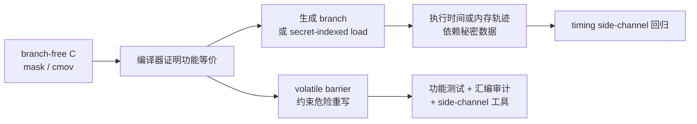
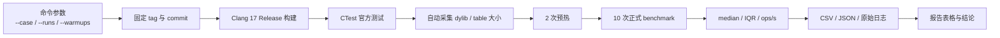
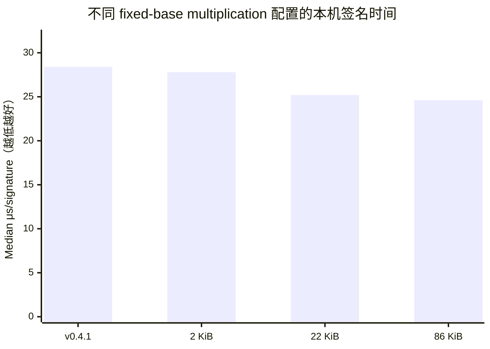

# libsecp256k1 的安全修复、性能优化与数学原理

> 从“未绑定消息的伪造”到 constant-time 与 fixed-base multiplication

**作者：** Bitcoin 实验一：任务二  
**日期：** 2026 年 7 月 20 日

## 摘要

Bitcoin 使用 secp256k1 椭圆曲线完成交易授权。其安全性不仅依赖 ECDSA/Schnorr 数学，也依赖消息摘要与交易语义的正确绑定、编译器不破坏 constant-time 代码，以及高效而可审计的有限域和点乘实现。本文以 `bitcoin-core/secp256k1` 稳定标签 `v0.7.1` 为基线，复核 `v0.3.1`、`v0.3.2` 的编译器相关 timing side-channel 修复，以及 `v0.4.1`、`v0.5.0/v0.5.1` 的性能演进。本文完整推导课件中的“验证器不检查被签消息”存在性伪造，并说明它攻击的是应用层消息绑定而非 ECDSA 的预定消息不可伪造性。七套 Release 构建的官方测试全部通过，其中新增 `v0.3.0/v0.3.1/v0.3.2` 三套安全版本构建；在 Apple ARM64/Clang 17 上，四套性能配置的 10 轮 `ecdsa_sign` benchmark 中位数为 28.4、27.8、25.2 和 24.6 μs，展示 signed-digit multi-comb 算法与 2/22/86 KiB 预计算表的时间—空间权衡。

**关键词：** secp256k1；ECDSA；Schnorr；constant-time；timing side-channel；multi-comb；Bitcoin

## 目录

1. [研究对象、证据与方法](#研究对象证据与方法)
2. [实验环境](#实验环境)
3. [secp256k1 与 ECDSA 数学](#secp256k1-与-ecdsa-数学)
4. [课件中的“未绑定消息伪造”](#课件中的未绑定消息伪造)
5. [Bitcoin 如何绑定被签内容](#bitcoin-如何绑定被签内容)
6. [安全修复案例](#安全修复案例)
7. [性能优化案例](#性能优化案例)
8. [复现实验脚本的技术实现](#复现实验脚本的技术实现)
9. [本机复现实验](#本机复现实验)
10. [正确性、性能与 constant-time 的关系](#正确性性能与-constant-time-的关系)
11. [结论](#结论)
12. [复现命令与数据位置](#复现命令与数据位置)
13. [参考文献](#参考文献)

---

## 研究对象、证据与方法

`libsecp256k1` 是面向 secp256k1 的高性能、高保证 C 库，提供 ECDSA、BIP340 Schnorr、ECDH、ElligatorSwift 与 MuSig2 等模块。本文采用三层证据：

1.  官方 tag/commit/PR 与 CHANGELOG，固定“何时、为何、改了什么”；

2.  源码结构和数学推导，解释安全或性能因果链；

3.  同机同编译器 Release 构建、官方 ctest 和重复 benchmark，验证本机可复现部分。

研究基线固定为表 <a href="#tab:tag-commits" data-reference-type="ref" data-reference="tab:tag-commits">2</a> 所列 tag，而不是随时间移动的 master。脚本从本地官方 Git 仓库执行 `git rev-parse` 和 `git show` 生成 `tag_commits.csv`；因此版本、commit 与日期不是人工抄写的常量。安全修复以修复前/后的 tag 构建，性能案例则以相同版本不同 CMake 参数做受控比较。

### 从结论到证据的追溯规则

本文把证据强度分为“本机直接测得”“固定源码直接观察”和“上游平台特有结论”三类。前两类可以在本目录内重建；第三类由于缺少相同 CPU、GCC 版本或微架构，只能引用官方 PR/CHANGELOG。表 <a href="#tab:evidence-levels" data-reference-type="ref" data-reference="tab:evidence-levels">1</a> 给出具体判据，避免把“成功编译”误写成“侧信道已被本机复现”，或把一次微基准误写成整个 Bitcoin 节点的端到端性能。

<div id="tab:evidence-levels">

| 证据级别 | 可支持的结论 | 不能据此推出 |
|:---|:---|:---|
| 本机 build/CTest | 指定 tag 在 ARM64/Clang 17 Release 下可构建，官方功能测试通过 | 任意编译器生成代码均 constant-time |
| 本机 10 轮 benchmark | 同机同配置下 `ecdsa_sign` 的 median、IQR 和相对差异 | 钱包、节点或网络吞吐量提高相同比例 |
| 固定 tag 源码/commit | 函数、宏、参数和算法在指定版本中的实际变化 | 该变化在所有 CPU 上具有同样性能收益 |
| 官方 PR/CHANGELOG | x86_64/GCC 10.5 或 GCC 13.1 等上游复现结果 | 本机 ARM64 已直接复现相同汇编或 timing 行为 |

本文采用的证据分级与表述边界

</div>

<div id="tab:tag-commits">

| Tag | Commit | 日期 | 在本文中的用途 |
|:---|:---|:---|:---|
| Tag | Commit | 日期 | 在本文中的用途 |
| v0.3.0 | `bdf39000b9c6` | 2023-03-08 | Clang conditional-move 修复前基线，已 build/test |
| v0.3.1 | `346a053d4c44` | 2023-04-10 | 包含 PR \#1257，已 build/test |
| v0.3.2 | `acf5c55ae6a9` | 2023-05-13 | 包含 PR \#1303，已 build/test |
| v0.4.0 | `199d27cea322` | 2023-09-04 | v0.4 系列的源码差异边界 |
| v0.4.1 | `1ad5185cd42c` | 2023-12-21 | 移除 x86_64 field assembly 后的 benchmark 基线 |
| v0.5.0 | `e3a885d42a78` | 2024-05-06 | multi-comb 与 2/22/86 KiB 三配置 |
| v0.5.1 | `642c885b6102` | 2024-08-01 | 默认预计算表调整与 API 文档证据 |
| v0.7.1 | `1a53f4961f33` | 2026-01-26 | 最新稳定研究基线与当前接口边界 |

固定研究标签与 commit 对照

</div>

## 实验环境

复现实验在同一台本地机器、同一编译器与 Release 配置下完成，环境信息由脚本写入 `results/environment.json`。关键配置如表 <a href="#tab:environment" data-reference-type="ref" data-reference="tab:environment">3</a>。

<div id="tab:environment">

| 项目 | 配置 |
|:---|:---|
| 硬件 | MacBook Pro（Mac14,9），Apple M2 Pro 10-core，16 GB memory |
| 操作系统 | macOS 15.6.1，ARM64 |
| Python | CPython 3.13.3 |
| C 编译器 | Apple Clang 17.0.0，target `arm64-apple-darwin24.6.0` |
| 构建工具 | CMake 4.4.0，Ninja 1.13.0 |
| 构建配置 | `CMAKE_BUILD_TYPE=Release`；七套构建均启用 tests，四套性能配置启用 benchmark |
| 测试 | CTest：`tests`、`noverify_tests`、`exhaustive_tests` |
| Benchmark | `SECP256K1_BENCH_ITERS=20000`；每组预热 2 次、正式运行 10 次 |
| 大小统计 | 自动定位非符号链接的 `libsecp256k1` 动态库，记录 bytes 与 KiB |

任务二本机实验环境

</div>

平台边界必须明确：GCC 13.1 的 ECDH constant-time 回归和 x86_64 handwritten assembly 的性能结论只能引用上游证据；本机 ARM64/Clang 数据不能冒充对 x86/GCC 结论的直接复现。为减少后台负载和温度变化带来的干扰，各配置采用相同构建类型、内部迭代次数、预热次数和正式运行次数；报告使用 median 与 IQR，而不是只报告单次最快结果。

## secp256k1 与 ECDSA 数学

### 有限域、曲线与群

secp256k1 定义在素域 $\mathbb{F}_p$ 上： $$p=2^{256}-2^{32}-977,
\qquad E:\ y^2=x^3+7\pmod p.$$ 生成元 $G$ 的阶为素数 $n$：

``` 
n = FFFFFFFFFFFFFFFFFFFFFFFFFFFFFFFE
    BAAEDCE6AF48A03BBFD25E8CD0364141
```

私钥 $d\in\{1,\ldots,n-1\}$，公钥 $P=dG$。从 $P$ 求 $d$ 被认为等价于求解 elliptic-curve discrete logarithm problem（ECDLP）。域元素模 $p$，而签名中的 nonce、$r,s$ 等 scalar 模 $n$；混淆两种模数会造成实现错误。

对不同的仿射点 $P=(x_1,y_1)$、$Q=(x_2,y_2)$，群加法为 $$\begin{align*}
\lambda&=(y_2-y_1)(x_2-x_1)^{-1}\bmod p,\\
x_3&=\lambda^2-x_1-x_2\bmod p,\\
y_3&=\lambda(x_1-x_3)-y_1\bmod p.
\end{align*}$$ 倍点时把斜率改为 $\lambda=3x_1^2(2y_1)^{-1}\bmod p$。这些公式说明 affine 坐标几乎每次加法都需要一次模逆；模逆明显比乘法昂贵。Jacobian 坐标用 $$x=X/Z^2,\qquad y=Y/Z^3$$ 表示同一个仿射点，把点乘循环中的大量求逆替换为有限域乘法与平方，只在最终归一化时求逆。这里 field limb 是对模 $p$ 坐标的机器字分块，scalar limb 则是对模 $n$ 整数的分块；两套 reduction、边界与 constant-time 条件不能互换。

##### 为什么 $p$ 与 $n$ 必须分开。

点坐标方程和斜率中的逆元都在 $\mathbb{F}_p$ 中计算；签名方程的 $d,k,r,s,e$ 则在 $\mathbb{Z}_n$ 中计算。$x(R)$ 首先是 $[0,p-1]$ 的域元素，ECDSA 再取 $r=x(R)\bmod n$，所以这里存在一次从 field 到 scalar 的显式转换。若用 $p$ 代替 $n$ 计算 $s$，点仍可能位于曲线上，但签名验证方程不成立；若用 $n$ 约简坐标，则连曲线群运算本身都被改变。这也是源码将 `secp256k1_fe` 与 `secp256k1_scalar` 设计为不同类型和 backend 的原因。

##### 压缩公钥恢复。

压缩公钥保存 1-byte 奇偶前缀与 32-byte $x$。由于 $p\equiv3\pmod4$，可由 $$y=\left(x^3+7\right)^{(p+1)/4}\bmod p$$ 得到一个平方根，再按前缀选择 $y$ 或 $p-y$。Task 2 的伪造复现实验正是这样从 Task 1 的公开压缩公钥恢复点 $P$，脚本中没有读取或保存对应私钥。

### ECDSA 签名与验证

对消息 $m$，先定义 $e=H(m)$（按协议规则解释或截断）。签名者选择秘密 nonce $k\in\mathbb{Z}_n^*$： $$\begin{align*}
R&=kG, & r&=x(R)\bmod n,\\
s&=k^{-1}(e+rd)\bmod n.
\end{align*}$$ 签名为 $(r,s)$。验证者检查范围后计算 $$\begin{align*}
w&=s^{-1}\bmod n,\\
R'&=(ew)G+(rw)P,
\end{align*}$$ 并接受当且仅当 $x(R')\bmod n=r$。正确性来自 $$s^{-1}(eG+rP)
=k(e+rd)^{-1}(e+rd)G
=kG=R.$$

nonce 不能复用：若同一 $k$ 对不同摘要 $e_1,e_2$ 产生 $(r,s_1),(r,s_2)$，则 $$k=(e_1-e_2)(s_1-s_2)^{-1}\bmod n,
\quad d=(s_1k-e_1)r^{-1}\bmod n.$$ 库默认使用 RFC6979-style derandomized nonce，并对 secret-key 操作追求 constant-time 与 constant-memory-access。

签名还必须检查 $r\ne0$、$s\ne0$；若出现零值就更换 nonce。数学上 $(r,s)$ 与 $(r,n-s)$ 都能通过 ECDSA 方程，因为二者对应纵坐标相反的点。Bitcoin 标准策略与 libsecp256k1 的 normalized signature 接口使用 low-S 表示来减少可塑性。这里 low-S 是编码规范化，不改变“验证器必须自己确定 $e$”这一消息绑定前提。

### 为什么验证可以 variable-time，而签名不可以

签名计算 $kG$、私钥调整和 ECDH 点乘的 scalar 是秘密；分支方向、循环次数、表索引或 cache line 若依赖这些值，就可能形成 timing/cache/power side-channel。验签中的 $e,r,s$ 和公钥已经公开，使用 wNAF 或 variable-time modular inverse 通常不额外泄漏秘密。所谓“普通性能优化”只要求结果相同且平均运行更快；密码学 secret path 的优化还必须保持控制流、内存访问和运算轮数不依赖秘密。二者的威胁模型不同，不能仅凭同一套 functional tests 互相替代。

## 课件中的“未绑定消息伪造”

给定公钥 $P=dG$，攻击者任选 $u,v\in\mathbb{Z}_n^*$，计算 $$R'=uG+vP=(x',y'),\qquad r'=x'\bmod n,$$ 并定义 $$s'=r'v^{-1}\bmod n,
\qquad e'=r'uv^{-1}\bmod n.$$ 由于 $$s'^{-1}=vr'^{-1},$$ 验证方得到 $$\begin{align*}
s'^{-1}(e'G+r'P)
&=(vr'^{-1})(r'uv^{-1}G+r'P)\\
&=uG+vP=R',
\end{align*}$$ 因此 $(r',s')$ 对摘要 $e'$ 验证成功。这里并不知道私钥 $d$。

关键限制是：攻击者先得到随机式的 $e'$，并没有为预先指定的消息 $m$ 生成签名。若正确验证器重新计算并要求 $e'=H(m)$，攻击者还必须求一个满足该摘要的消息，这退化为对哈希函数的 preimage 问题。故课件展示的是：**如果应用只接受调用者传入的摘要，却不把摘要与实际消息重新绑定，就可产生存在性伪造。**它不是 Bitcoin ECDSA 已被破解。

这一边界也直接写在官方 API 文档中。`v0.5.1/include/secp256k1.h` 的 ECDSA verify 注释要求 verifier 自己对消息应用密码学哈希、不得直接接受外部 `msghash32`，否则无需知道私钥也容易构造“有效”签名。也就是说，课件推导不是脱离实现的理论提醒，而是库接口明确要求调用者承担的安全前置条件。

### 可执行复现：只伪造攻击者选择的摘要

`scripts/forge_digest_demo.py` 使用 Task 1 已公开的压缩公钥，不包含私钥。脚本实现有限域点加、double-and-add 标量乘法和 ECDSA digest verification，固定选择 $u=\texttt{0x12345}$、$v=\texttt{0x6789a}$，随后直接按课件公式构造 $r',s',e'$。关键代码见清单 <a href="#lst:forge-demo" data-reference-type="ref" data-reference="lst:forge-demo">[lst:forge-demo]</a>。

``` numberLines
def main() -> None:
    public_key = decompress_public_key(PUBLIC_KEY_COMPRESSED)
    u = 0x12345
    v = 0x6789A
    candidate = point_add(scalar_multiply(u, G), scalar_multiply(v, public_key))
    if candidate is None:
        raise RuntimeError("chosen u and v unexpectedly produced the point at infinity")
    r_forged = candidate[0] % N_ORDER
    s_forged = r_forged * inverse(v, N_ORDER) % N_ORDER
    e_chosen = r_forged * u * inverse(v, N_ORDER) % N_ORDER
    fixed_digest = int.from_bytes(hashlib.sha256(FIXED_MESSAGE).digest(), "big") % N_ORDER

    result = {
        "public_key_compressed": PUBLIC_KEY_COMPRESSED,
        "attacker_inputs": {"u_hex": hex(u), "v_hex": hex(v)},
        "forged_signature": {"r_hex": f"{r_forged:064x}", "s_hex": f"{s_forged:064x}"},
        "attacker_chosen_digest_hex": f"{e_chosen:064x}",
        "chosen_digest_verifies": verify_digest(public_key, e_chosen, r_forged, s_forged),
        "fixed_message_utf8": FIXED_MESSAGE.decode(),
        "fixed_message_sha256_hex": f"{fixed_digest:064x}",
        "fixed_message_verifies": verify_digest(public_key, fixed_digest, r_forged, s_forged),
        "private_key_used_by_attack": False,
    }
```

实际运行生成 `results/forgery_demo.json`。核心结果为 $$\begin{align*}
r'&=\texttt{c112f16c4ceb476cfc9186a95a134f2787cc0302df91716f017ee03d9d29dc25},\\
s'&=\texttt{0959104f04009a0e9ff14754cf675b312ecb5d779ba33969eaa4c3c00b7b38b5},\\
e'&=\texttt{c28b36d8c34825c0601da19e638489f5d0c65a53bb0a23f7ee1aba9248ca32a7}.
\end{align*}$$ `chosen_digest_verifies=true`，证明验证器若信任调用者给出的 $e'$ 就会接受；但固定消息 `course project fixed message` 的 SHA256 为 $$\texttt{a08f44448d8af4f6d471826c1f757f743760031871006ee60f1ac5727d5b2cd4},$$ 相同 $(r',s')$ 对它得到 `fixed_message_verifies=false`。这一正反对照把攻击边界具体化：攻击者能选择“签名所对应的摘要”，却不能把它移植到预先指定的消息。

## Bitcoin 如何绑定被签内容

Bitcoin 的签名不是对 explorer 展示文本签名，而是对严格序列化的 transaction digest 签名。不同脚本版本使用不同 sighash 规则：

- Legacy ECDSA：从交易副本和 scriptCode 构造摘要；历史上计算复杂且容易出现二次哈希工作。

- SegWit v0/BIP143 ECDSA：显式承诺 prevouts、sequences、当前 outpoint、scriptCode、**输入金额**、outputs、locktime 与 sighash type。

- Taproot：BIP340 Schnorr 签名由 BIP341/342 的 tagged hash 绑定交易上下文、Taproot key/script path 等语义。

节点从交易和被花费输出自行重建 digest，不接受交易发送者随意声明“这个 hash 对应某消息”。因此上述 $e'$ 技巧不能把任意伪造签名附着到一笔指定的有效 Bitcoin 花费上。

### 以 SegWit v0 为例的消息绑定链

对 `SIGHASH_ALL`，BIP143 预映像不仅含当前输入，还通过三个 double-SHA256 聚合值承诺所有 outpoint、sequence 和 outputs。当前输入部分再显式写入 outpoint、scriptCode、被花费金额与 sequence，最后加入 locktime 和 4-byte sighash type。其安全意义可按字段拆分：

<div id="tab:bip143-binding">

| 预映像字段 | 承诺内容 | 若未绑定可能出现的问题 |
|:---|:---|:---|
| `hashPrevouts` | 全部输入引用的 TXID/vout | 将签名移到另一组 UTXO |
| `hashSequence` | 全部输入 sequence | 改变 RBF 或相对锁定语义 |
| 当前 outpoint/scriptCode | 正在验证的 UTXO 与花费条件 | 用另一种 locking condition 解释同一签名 |
| 当前输入 amount | 被花费金额 | 离线签名器无法检测主机谎报输入金额 |
| `hashOutputs` | 全部输出金额与 scriptPubKey | 替换收款人或找零 |
| version/locktime/type | 交易版本、绝对锁定和签名模式 | 改变整体交易语义或承诺范围 |

BIP143 `SIGHASH_ALL` 字段与防篡改语义

</div>

节点获得交易、前序输出和正在执行的 Script 上下文后，按共识规则重新序列化这些字段并计算 $e$。攻击者即使有上一节构造的 $(r',s',e')$，也必须让这套规范序列化的 double-SHA256 恰好等于 $e'$；在哈希预映像抗性假设下不可行。Task 1 已对真实 P2WPKH 交易执行这一重建，因而两个任务在“公式、代码和链上实例”三个层面相互闭合。

Schnorr 采用形如 $sG=R+eP$ 的线性验证关系，便于 multisignature 与 batch verification；BIP340 通过 key prefixing、唯一 x-only 编码和 tagged hashing 防止相关构造中的歧义。它与 ECDSA 使用同一曲线，但签名方程和安全证明不同。

更具体地，BIP340 令 x-only 公钥为 $P$，nonce 点为 $R=kG$，并计算 tagged challenge $$e=H_{\mathrm{BIP0340/challenge}}(x(R)\parallel x(P)\parallel m)\bmod n,
\qquad s=k+ed\bmod n.$$ 验证检查 $sG=R+eP$，同时约束 $R$ 的偶数 $y$ 与坐标范围。challenge 同时包含 $R$、公钥 $P$ 与消息 $m$，所以线性方程本身不等于“消息未绑定”。BIP341 的 Taproot sighash 再把交易输入、输出、金额、scriptPubKey、annex 与 spend type 等上下文按规则纳入 $m$。

<div id="tab:bitcoin-usage">

| 场景 | 算法/入口 | 被绑定的数据 | 性能/侧信道重点 |
|:---|:---|:---|:---|
| Legacy 花费 | ECDSA + legacy sighash | 交易副本、scriptCode、sighash type | 签名 secret；验证 public |
| SegWit v0 | ECDSA + BIP143 | prevouts、金额、outputs 等 | 摘要可缓存，避免历史二次工作 |
| Taproot | BIP340 + BIP341/342 | tagged transaction digest 与 spend path | x-only key、Schnorr、batch-friendly |
| 钱包密钥/签名 | key generation、ecmult_gen | private key、nonce | 必须 constant-time、blinding |
| 可选协议模块 | ECDH/MuSig 等 | 协议各自 transcript | scalar 常含秘密，不能套用公开验签假设 |

secp256k1 在 Bitcoin 相关场景中的算法与秘密边界

</div>

## 安全修复案例

<table>
<thead>
<tr>
<th style="text-align: left;">版本</th>
<th style="text-align: left;">Merge commit / PR</th>
<th style="text-align: left;">风险</th>
<th style="text-align: left;">修复要点</th>
</tr>
</thead>
<tbody>
<tr>
<td style="text-align: left;">v0.3.1</td>
<td style="text-align: left;"><code>2d51a454</code><br />
PR #1257</td>
<td style="text-align: left;">Clang 15 能把源代码 cmov 重新编译成 branch</td>
<td style="text-align: left;">在 field/scalar cmov 的 condition 上使用 volatile trick，阻止秘密相关控制流/内存访问</td>
</tr>
<tr>
<td style="text-align: left;">v0.3.2</td>
<td style="text-align: left;"><code>ab5a9171</code><br />
PR #1303</td>
<td style="text-align: left;">GCC 13.1 下 ECDH 路径可能出现 secret-dependent control flow</td>
<td style="text-align: left;">在 scalar conditional negation 等更多“条件路径”谨慎使用 volatile，并扩展新编译器 CI</td>
</tr>
</tbody>
</table>

### 为什么“源代码无 if”仍不够

常见 branch-free select 写成位掩码： $$z=(x\land \neg m)\lor(y\land m),$$ 其中 $m$ 由秘密条件扩展为全零或全一。编译器在抽象机语义上可以证明它等价于条件选择，并生成 branch 或 secret-indexed load；C 语言本身不承诺 timing behavior。故 constant-time 是“源码 + 编译器版本 + flags + 目标架构”的联合属性。

v0.3.1 的 PR \#1257 明确记录 Clang 15 对 field element cmov 的这种重写。将条件经 volatile 读取能限制某些优化，但它仍是工程防线而非语言级证明。因此项目随后增加对开发版 GCC/Clang、Valgrind/内存检查、无额外 VERIFY 的 production-like tests，并持续检查生成代码。



*图：constant-time 回归的因果链。功能等价的编译器优化仍可能改变可观测时间行为。*

### v0.3.1：field/scalar cmov 的修复证据

下面是固定 tag 中 `src/field_5x52_impl.h` 的关键差异；其余 limb 的 select 逻辑不变。

``` objectivec
/* v0.3.0 */
mask0 = flag + ~((uint64_t)0);
mask1 = ~mask0;

/* v0.3.1 */
volatile int vflag = flag;
mask0 = vflag + ~((uint64_t)0);
mask1 = ~mask0;
```

当 flag 为 0 时，`mask0` 为全 1、保留原值；flag 为 1 时，`mask1` 为全 1、选择新值。问题不在这个代数掩码的功能正确性，而在优化器可能识别“二选一”语义并生成 secret-dependent branch 或 load。volatile 读取为该编译器优化建立屏障，使后续 bitwise select 保持预期形态。相同策略同步用于不同 field/scalar backend，而不是只修一个架构文件。

### v0.3.2：GCC 13.1 ECDH 路径的扩大修复

v0.3.2 继续检查不叫 `cmov`、但同样由秘密 flag 控制的辅助函数。例如 `scalar_cond_negate` 的前后差异如下。

``` objectivec
/* v0.3.1 */
uint64_t mask = !flag - 1;

/* v0.3.2 */
volatile int vflag = flag;
uint64_t mask = -vflag;
```

并在 `scalar_cadd_bit` 中同样通过 volatile 读取 flag。ECDH 入口先把外部 32-byte scalar 归约并以 conditional move 处理 overflow/zero，然后调用 constant-time `ecmult_const`。因此 GCC 13.1 若在这些辅助条件上恢复秘密分支，最终可能污染 ECDH 的 constant-time 性质，即使输出点仍完全正确。修复的“why”是生成代码的时间行为而不是群运算公式错误；这也解释了为何 CTest 通过不能单独证明 side-channel 安全。

### 影响边界

timing side-channel 需要攻击者获得足够精细、重复的时间或微架构观测；它与“单次远程请求立即恢复私钥”不同。v0.3.2 的直接问题位于 optional ECDH module，不应写成 Bitcoin transaction verification 本身已泄漏私钥。但同一库被钱包、硬件设备、Lightning/P2P 组件使用，constant-time 回归仍属于必须快速升级的密码学工程风险。

## 性能优化案例

### 域、标量与群运算

库避免 floating point 和 runtime heap allocation。域元素模 $p$ 可用 5 个 52-bit limbs 或 10 个 26-bit limbs；scalar 模 $n$ 可用 4 个 64-bit 或 8 个 32-bit limbs。点通常使用 Jacobian $(X:Y:Z)$ 表示，使 affine $x=X/Z^2,y=Y/Z^3$，从而用乘法替代频繁且昂贵的 field inversion。

验证需要 $aP+bG$。库综合使用 wNAF、对固定生成元 $G$ 的大窗口预计算、Shamir’s trick 和 secp256k1 endomorphism，将两个点乘合并并把部分 scalar 分裂为较短分量。模逆采用 safegcd 及其 variable-time 变体：secret-dependent 路径必须用 constant-time 版本；公开验证数据可使用 variable-time 版本换取速度。

wNAF 把 scalar 表示成稀疏的有符号奇数 digit，使非零项之间至少相隔若干位，从而减少点加法；Shamir’s trick 在一次从高位到低位的扫描中联合计算 $aP+bG$，复用 doubling。secp256k1 还存在高效 endomorphism $\phi(P)=\lambda P$，可把 256-bit scalar 分解为两个约 128-bit 分量并行处理。fixed-base $kG$ 与 variable-base $kP$ 的区别在于 $G$ 永远固定，因而可以在编译期投入更大预计算表；任意 $P$ 则必须现场建立小表或使用不同算法。

##### safegcd modular inverse。

ECDSA signing 需要 $k^{-1}\bmod n$，verification 需要 $s^{-1}\bmod n$，Jacobian 点最终转回 affine 也涉及域逆。朴素扩展欧几里得算法的迭代次数依赖输入，不适合秘密 scalar；费马小定理幂运算可固定模式但乘法数量较高。libsecp256k1 的 safegcd 路径使用有界 divsteps 和适合 limb 表示的矩阵更新；秘密路径采用 constant-time 版本，公开验证数据则允许 variable-time 版本提前结束。这再次说明同一个数学操作会因输入是否保密而选择不同实现。

### v0.4.1：删除 handwritten x86_64 assembly

PR \#1446（merge `10e6d29b`）删除 field operation 的手写 x86_64 assembly。原因不是“assembly 天生慢”，而是现代编译器对对应 C 代码生成了更好的指令调度。官方 CHANGELOG 在 GCC 10.5 上报告 ECDSA verify 与 Schnorr verify 约 10% 提升。该数字只适用于其 x86_64/GCC 环境；本文 ARM64 benchmark 不把它当本机结果。

### v0.5.0：signed-digit multi-comb ecmult_gen

签名和公钥生成核心是 fixed-base multiplication $kG$。PR \#1058（merge `da515074`）引入 signed-digit multi-comb：将 scalar 重编码为 $\{-1,0,1\}$ 型 digit，把多个相隔固定 stride 的位组合为 table index，再以固定次数的 doubling、constant-time lookup 与 addition 完成点乘。实现同时处理：

- 第一次 table lookup 不需要额外 point addition；

- 预计算避免不必要的 doublings；

- projective blinding 和未知离散对数的偏移点降低 side-channel 可控性；

- 提供 2、22、86 KiB 配置以适应嵌入式与桌面环境。

PR 上游记录 GCC 13.2 约 12.4%、Clang 15 约 11.5% 的提升。v0.5.1 的 PR \#1564（merge `ca06e58b`）将默认表从 22 KiB 调整到 86 KiB，与 Bitcoin Core 默认配置对齐。

### multi-comb 的代数推导与参数含义

`v0.5.0/src/ecmult_gen_impl.h` 先定义 $B=\texttt{COMB\_BITS}$，以及 $$\operatorname{comb}(s,P)=\sum_{i=0}^{B-1}(2s_i-1)2^iP
=\bigl(2s-(2^B-1)\bigr)P.$$ 为了计算 $R=g_nG$ 且避免模 2 除法，实现以随机 blinding scalar $b$ 设置 $$\begin{align*}
\textit{scalar\_offset}&=(2^B-1)/2-b\pmod n,\\
\textit{ge\_offset}&=bG,\\
d&=g_n+\textit{scalar\_offset}\pmod n,\\
R&=\operatorname{comb}(d,G/2)+\textit{ge\_offset}.
\end{align*}$$ 代入第一式可见中间的 $bG$ 和 $(2^B-1)G/2$ 偏移最终严格抵消；随机化改变的是内部表示与中间点，不改变输出 $g_nG$。

若 block 编号为 $b$、每个 block 有 $T$ 个 teeth、spacing 为 $S$，源码定义 $$\operatorname{mask}(b)=\sum_{t=0}^{T-1}2^{(bT+t)S},\qquad
\operatorname{table}(b,m)=\left(m-\frac{\operatorname{mask}(b)}{2}\right)G.$$ 最终计算可写成 $$\sum_{i=0}^{S-1}2^i
\sum_{b=0}^{\mathrm{blocks}-1}
\operatorname{table}\!\left(b,(d\!\gg\! i)\land\operatorname{mask}(b)\right).$$ 外层从 $S-1$ 逆序到 0，每轮对所有 block 加一个表项，轮间倍点。表索引由秘密 scalar 决定，因此不能直接做 secret-indexed array load；实现遍历候选并用 cmov 选择。又因为翻转 mask 中所有 relevant bits 会得到相反点，只需存一半候选，表项数为 $$\mathrm{blocks}\times 2^{\mathrm{teeth}-1}.$$

表 <a href="#tab:comb-parameters" data-reference-type="ref" data-reference="tab:comb-parameters">6</a> 把三种 CMake 配置换算成源码注释给出的实际工作量。spacing 取 $\lceil256/(\mathrm{blocks}\times\mathrm{teeth})\rceil$，点加次数为 blocks$\times$spacing，倍点次数为 spacing$-1$。

<div id="tab:comb-parameters">

| 配置   | blocks | teeth | spacing |  表项 | 点加 | 倍点 |
|:-------|-------:|------:|--------:|------:|-----:|-----:|
| 2 KiB  |      2 |     5 |      26 |    32 |   52 |   25 |
| 22 KiB |     11 |     6 |       4 |   352 |   44 |    3 |
| 86 KiB |     43 |     6 |       1 | 1,376 |   43 |    0 |

v0.5.0 三种 ecmult_gen 预计算配置的算法参数

</div>

2 KiB 配置节省静态空间，但必须执行 25 次倍点；22 KiB 大幅减少 doubling，并把点加从 52 次降至 44 次；86 KiB 用 1,376 个预计算点把 spacing 降到 1，消除循环中的倍点，但 cmov 扫描和 cache footprint 更大，所以相对 22 KiB 的边际收益小于 2 到 22 KiB 的跃迁。这是可由源码参数解释的时间–空间权衡，而不只是 benchmark 表面相关性。算法来源可追溯到 Hamburg 的 compact elliptic-curve multiplication 工作。

## 复现实验脚本的技术实现

### 从命令参数到可复现产物

`scripts/reproduce.py` 将元数据、构建、库大小和 benchmark 组织为显式 case，而不是把一次终端操作后的文件手工搬入报告。清单 <a href="#lst:task2-main" data-reference-type="ref" data-reference="lst:task2-main">[lst:task2-main]</a> 展示顶层调度：除单独的 `sizes` 外，流程先确保固定 tag/worktree 存在并重新收集 tag commit、环境和版本 diff；`build/all` 执行七套构建，其他 case 读取已有 build matrix；库大小始终在 benchmark 之前生成，`benchmark/all` 才执行重复测量。



*图：Task 2 的 case 驱动复现流水线。测试、库大小和性能数据均由同一脚本生成。*

``` numberLines
def main() -> None:
    parser = argparse.ArgumentParser(description="Reproduce libsecp256k1 tag, test, and benchmark evidence")
    parser.add_argument("--case", choices=["metadata", "build", "sizes", "benchmark", "all"], default="all")
    parser.add_argument("--runs", type=int, default=10)
    parser.add_argument("--warmups", type=int, default=2)
    args = parser.parse_args()
    if args.case == "sizes":
        collect_library_sizes(select_benchmark_builds(load_build_matrix()))
        return
    ensure_repo()
    collect_metadata()
    if args.case == "metadata":
        return
    if args.case in {"build", "all"}:
        builds = run_builds()
    else:
        builds = load_build_matrix()
    benchmark_builds = select_benchmark_builds(builds)
    collect_library_sizes(benchmark_builds)
    if args.case in {"benchmark", "all"}:
        benchmark(benchmark_builds, args.warmups, args.runs)
```

这一结构解决了两类可复现性问题。第一，报告不依赖当前 Git 分支：`ensure_repo` 为每个固定 tag 建立 detached worktree，`collect_metadata` 再由 Git 写出 tag/commit 对照。第二，`sizes` 必须读取 `build_matrix.json` 并验证四个性能 build 均存在，缺少配置时明确失败，不会静默输出不完整 CSV。

<div id="tab:task2-artifacts">

| 产物 | 生成阶段 | 在报告中的用途 |
|:---|:---|:---|
| `tag_commits.csv/json` | metadata | 固定 tag、commit、日期与版本边界 |
| `build_matrix.json` | build | 记录七套配置、测试日志路径和用途 |
| `raw/ctest_*.txt` | build | 证明每套官方测试的实际退出结果 |
| `benchmark_runs.csv` | benchmark | 保存 40 个正式样本，不用汇总值替代原始数据 |
| `benchmark_summary.csv` | benchmark | median、$Q_1$、$Q_3$、IQR 与 ops/s |
| `library_sizes.csv/json` | sizes/build/all | 从真实库 artifact 自动生成 bytes/KiB |
| `forgery_demo.json` | forge demo | 保存攻击者选择摘要成功、固定消息失败的正反结果 |

复现脚本产物与报告结论的对应关系

</div>

### 同配置构建、CTest 与原始日志

清单 <a href="#lst:task2-build" data-reference-type="ref" data-reference="lst:task2-build">[lst:task2-build]</a> 给出每套 build 的实际 CMake 参数。source 和 build 目录按 tag/variant 分离；编译器固定为 Clang，构建类型固定为 Release，所有配置启用官方 tests，而 benchmark 只为四套性能配置开启。configure、build、CTest 三步均使用 `check=True`，任一步非零退出都会终止流程，同时把已有输出写入对应日志供定位。

``` numberLines
def configure_and_build(tag: str, variant: str, extra: list[str]) -> Path:
    source = SOURCES / tag
    build = BUILDS / f"{tag}-{variant}"
    build.mkdir(parents=True, exist_ok=True)
    command = [
        executable("cmake"),
        "-S",
        str(source),
        "-B",
        str(build),
        "-G",
        "Ninja",
        f"-DCMAKE_MAKE_PROGRAM={executable('ninja')}",
        "-DCMAKE_BUILD_TYPE=Release",
        "-DCMAKE_C_COMPILER=clang",
        "-DSECP256K1_BUILD_TESTS=ON",
        f"-DSECP256K1_BUILD_BENCHMARK={'ON' if (tag, variant) in BENCHMARK_KEYS else 'OFF'}",
        *extra,
    ]
    RAW.mkdir(parents=True, exist_ok=True)
    run_and_log(command, RAW / f"configure_{tag}_{variant}.txt")
    run_and_log(
        [executable("cmake"), "--build", str(build), "--parallel"],
        RAW / f"build_{tag}_{variant}.txt",
    )
    run_and_log(
        [executable("ctest"), "--test-dir", str(build), "--output-on-failure"],
        RAW / f"ctest_{tag}_{variant}.txt",
    )
    return build
```

七个配置由 `SECURITY_TEST_CONFIGS + BENCHMARK_CONFIGS` 统一驱动。前三个 tag 只验证修复前后的可构建性与官方测试；后四个配置才进入性能样本，因而不会把安全版本的不同代码基线误混为预计算表对照。

### 预热、重复测量与统计汇总

benchmark 执行前把 `SECP256K1_BENCH_ITERS` 固定为 20,000。清单 <a href="#lst:task2-bench-runs" data-reference-type="ref" data-reference="lst:task2-bench-runs">[lst:task2-bench-runs]</a> 先执行指定次数的预热但不记录，再为每次正式运行保存完整 stdout，并同时记录官方 `ecdsa_sign` 行、外部 wall time 和 benchmark binary size。即使后续统计脚本出现问题，原始输出仍能独立复查。

``` numberLines
def benchmark(builds: list[tuple[str, str, Path]], warmups: int, runs: int) -> None:
    rows: list[dict[str, Any]] = []
    for tag, variant, build in builds:
        bench = find_benchmark(build)
        environment = os.environ.copy()
        environment["SECP256K1_BENCH_ITERS"] = "20000"
        for _ in range(warmups):
            run([str(bench), "ecdsa_sign"], env=environment)
        for index in range(runs):
            started = time.perf_counter()
            completed = run([str(bench), "ecdsa_sign"], env=environment)
            wall_seconds = time.perf_counter() - started
            output_path = RAW / f"bench_{tag}_{variant}_{index + 1:02d}.txt"
            output_path.write_text(completed.stdout, encoding="utf-8")
            microseconds = parse_microseconds(completed.stdout)
            rows.append(
                {
                    "tag": tag,
                    "variant": variant,
                    "run": index + 1,
                    "microseconds_per_signature": microseconds,
                    "operations_per_second": 1_000_000.0 / microseconds,
                    "wall_seconds": wall_seconds,
                    "benchmark_binary_bytes": bench.stat().st_size,
                }
            )
```

汇总阶段按 tag/variant 分组，使用 Python 标准库的 inclusive quartiles 与 median，直接生成报告引用的 median、$Q_1$、$Q_3$、IQR 和 ops/s，如清单 <a href="#lst:task2-statistics" data-reference-type="ref" data-reference="lst:task2-statistics">[lst:task2-statistics]</a>。这里没有先四舍五入逐次数据；表格中的显示精度只在报告层处理。

``` numberLines
    summaries: list[dict[str, Any]] = []
    for tag, variant, _ in builds:
        group = [row for row in rows if row["tag"] == tag and row["variant"] == variant]
        values = [float(row["microseconds_per_signature"]) for row in group]
        quartiles = statistics.quantiles(values, n=4, method="inclusive")
        median_us = statistics.median(values)
        summaries.append(
            {
                "tag": tag,
                "variant": variant,
                "runs": len(values),
                "median_microseconds_per_signature": median_us,
                "q1_microseconds": quartiles[0],
                "q3_microseconds": quartiles[2],
                "iqr_microseconds": quartiles[2] - quartiles[0],
                "median_operations_per_second": 1_000_000.0 / median_us,
                "benchmark_binary_bytes": group[0]["benchmark_binary_bytes"],
            }
        )
    with (RESULTS / "benchmark_summary.csv").open("w", newline="", encoding="utf-8") as handle:
        writer = csv.DictWriter(handle, fieldnames=list(summaries[0]))
        writer.writeheader()
        writer.writerows(summaries)
    write_json(RESULTS / "benchmark_summary.json", summaries)
```

### 自动生成库大小结果

库大小不能由报告作者观察 Finder 后手工填写。脚本递归寻找 `libsecp256k1` 动态库，明确排除符号链接；没有动态库时才回退到静态库，并选择实际文件而不是 symlink 名称。清单 <a href="#lst:task2-library-size" data-reference-type="ref" data-reference="lst:task2-library-size">[lst:task2-library-size]</a> 把 tag、variant、CMake 表配置、相对 artifact 路径、bytes 和 KiB 同时写入 CSV/JSON。于是删除 build tree 后执行一次 `--case all`，即可从构建产物重新生成报告中的全部大小数字。

``` numberLines
def collect_library_sizes(builds: list[tuple[str, str, Path]]) -> None:
    table_sizes: dict[str, int | str] = {
        "default": "version default",
        "table2k": 2,
        "table22k": 22,
        "table86k": 86,
    }
    rows: list[dict[str, Any]] = []
    for tag, variant, build in builds:
        artifact = find_library_artifact(build)
        size = artifact.stat().st_size
        rows.append(
            {
                "tag": tag,
                "variant": variant,
                "ecmult_gen_table_kib": table_sizes.get(variant, "unknown"),
                "library_artifact": str(artifact.relative_to(ROOT)),
                "library_bytes": size,
                "library_kib": round(size / 1024, 4),
            }
        )
    with (RESULTS / "library_sizes.csv").open("w", newline="", encoding="utf-8") as handle:
        writer = csv.DictWriter(handle, fieldnames=list(rows[0]))
        writer.writeheader()
        writer.writerows(rows)
    write_json(RESULTS / "library_sizes.json", rows)
```

## 本机复现实验

### 方法

所有配置使用同一 Apple Clang 17、CMake Release、Ninja。安全案例增加 `v0.3.0`、`v0.3.1`、`v0.3.2` 三套 build，与原有四套性能 build 合计七套；每套均运行官方 `ctest`，三项测试（tests、noverify_tests、exhaustive_tests）全部通过。安全版本只做 build/test，避免混入性能对照；`ecdsa_sign` 仍仅对四套性能配置各预热 2 次、正式运行 10 次，每次内部迭代 20,000，报告 10 次 Avg(us) 的 median 与 inclusive IQR。

每次正式运行产生一个独立观测 $t_i$。汇总脚本按 $$\widetilde t=\operatorname{median}(t_1,\ldots,t_{10}),\qquad
\mathrm{IQR}=Q_{0.75}-Q_{0.25},\qquad
\mathrm{ops/s}=10^6/\widetilde t$$ 计算结果；相对基线的降时比例为 $(t_{\mathrm{base}}-t_{\mathrm{new}})/t_{\mathrm{base}}$。median 降低偶发调度尖峰的影响，IQR 展示中间 50% 运行的离散度。预热结果不进入 CSV 的正式统计；所有原始行保留，报告数字可以从 `benchmark_runs.csv` 重新生成。

| 配置           | 用途                           | CTest      |
|:---------------|:-------------------------------|:-----------|
| v0.3.0 default | Clang constant-time 修复前基线 | 3/3 passed |
| v0.3.1 default | Clang 修复后、GCC ECDH 修复前  | 3/3 passed |
| v0.3.2 default | GCC ECDH constant-time 修复后  | 3/3 passed |
| v0.4.1 default | 性能对照基线                   | 3/3 passed |
| v0.5.0 2 KiB   | 小预计算表                     | 3/3 passed |
| v0.5.0 22 KiB  | 中预计算表                     | 3/3 passed |
| v0.5.0 86 KiB  | 大预计算表                     | 3/3 passed |

Apple ARM64/Clang 17 的 Release 构建与测试矩阵

| 配置           |  $Q_1$ | Median |  $Q_3$ |  IQR |  ops/s | dylib bytes |
|:---------------|-------:|-------:|-------:|-----:|-------:|------------:|
| v0.4.1 default | 28.225 |   28.4 | 28.475 | 0.25 | 35,211 |   1,336,120 |
| v0.5.0 2 KiB   | 27.725 |   27.8 | 27.875 | 0.15 | 35,971 |   1,270,344 |
| v0.5.0 22 KiB  | 25.100 |   25.2 | 25.300 | 0.20 | 39,683 |   1,286,856 |
| v0.5.0 86 KiB  | 24.500 |   24.6 | 24.600 | 0.10 | 40,650 |   1,352,904 |

Apple ARM64/Clang 17 的 ECDSA signing 结果



*图：Apple ARM64/Clang 17 上四种配置的 `ecdsa_sign` 中位耗时。*

相对 v0.4.1，2/22/86 KiB 配置的时间分别下降 2.11%、11.27%、13.38%。同一 v0.5.0 内，22 KiB 相比 2 KiB 增加约 16.1 KiB dylib 大小并显著降时；86 KiB 再增加约 64.5 KiB，收益缩小，体现 cache footprint 与 lookup/addition 次数的权衡。

不同 tag 的 dylib 总大小还受版本代码变化影响，不能把 v0.4.1 与 v0.5.0 的总大小差异完全归因于表；只有 v0.5.0 三配置之间是受控比较。类似地，本机 11.27% 与上游 Clang 数据接近，但架构、编译器版本和 CPU 不同，属于相互一致的独立观察，不是逐位复现。

library size 也由同一个 `reproduce.py` 自动生成：脚本在每个 build tree 中排除符号链接，定位实际 `libsecp256k1` 动态库并写入 bytes/KiB、tag 和 table 配置。这样删除 `work/builds` 后执行一次 `--case all`，能重新产生 build/test 日志、逐次 benchmark、统计汇总和 `library_sizes.csv`，避免报告中出现不可追溯的手填大小。

### 结果解释：算法收益与测量噪声

`v0.4.1` 的第 3 轮为 31.2 $\mu$s，明显高于其余多数 28.0–28.6 $\mu$s 样本；median 仍为 28.4 $\mu$s，而均值会被该调度尖峰向上拉动。三种 `v0.5.0` 配置的 IQR 分别为 0.15、0.20 和 0.10 $\mu$s，说明中间 50% 样本较集中。报告保留这条较慢样本，没有为了得到更漂亮的图而删除 outlier。

受控性最强的比较是同一 `v0.5.0` tag 的 2/22/86 KiB：源代码版本、编译器、构建类型和 benchmark binary size 均相同，主要自变量是 `SECP256K1_ECMULT_GEN_KB`。2 KiB 到 22 KiB 的 median 下降 2.6 $\mu$s，对应算法参数中 25 次 doubling 降为 3 次；22 KiB 到 86 KiB 只再下降 0.6 $\mu$s，同时动态库增加约 64.5 KiB。因而“更大表更快”不是线性规律，超过 22 KiB 后收益已呈明显递减。

## 正确性、性能与 constant-time 的关系

三项目标不能互相替代：

- **功能正确性：** 对合法输入给出正确签名/验证结果；官方 vectors、exhaustive tests 和 Wycheproof 覆盖边界。
- **密码学安全性：** nonce、消息绑定、输入范围和群运算满足方案假设，无法用代数关系伪造预定消息。
- **侧信道安全性：** 执行路径、内存访问和功耗不泄漏 secret；即使数学输出正确，编译器引入 branch 仍可能失败。

性能优化必须保持前两项。`libsecp256k1` 的策略是固定次数运算、constant-time table lookup、branch-free conditional move、blinding、无堆分配、严格 API 与广泛测试。公开数据验证可以安全采用 variable-time 算法，而 signing/private-key generation 不能因为 benchmark 更快就接受 secret-dependent 路径。

### 实验能证明什么，不能证明什么

七套构建与 CTest 证明这些 tag 在本机 Release 配置下可以编译，且官方功能/穷举测试通过；四组 benchmark 量化 Apple ARM64/Clang 17 上特定签名微基准的相对性能。它们不能证明任意编译器生成代码均 constant-time，也不能把微基准收益直接等同于钱包端到端吞吐量。本文没有在 x86_64 上重跑 GCC 13.1 或 GCC 10.5，故 v0.3.2 与 v0.4.1 的平台特有结论只依据官方 PR/CHANGELOG；本机 build/test 是版本可构建性的补充证据，而非该侧信道或 assembly 性能结果的直接复现。

此外，macOS 动态调频、温度、后台调度与 cache 状态仍可能影响微秒级测量。相同机器、相同工具链、预热、重复运行和 median/IQR 只能降低而不能消除这些因素。三种 v0.5.0 表大小之间的受控比较最强；跨 tag 的总库大小与运行时间还叠加其他源代码变化，解释时应保持这一因果边界。

## 结论

课件的伪造推导揭示了一个通用原则：签名验证必须重新建立“消息语义 $\rightarrow$ 规范序列化 $\rightarrow$ digest $\rightarrow$ signature”的完整链条。Bitcoin 的 sighash 正是该绑定，而不是让交易发送者自由声明 digest。

`v0.3.1/v0.3.2` 表明 constant-time 不是看源码有没有 `if`，而是需要持续对新编译器与目标架构审计。`v0.4.1/v0.5.x` 表明高级数学表示、现代编译器和预计算表共同决定性能。本机数据验证了 signed-digit multi-comb 在 ARM64 上的收益，并量化了 2/22/86 KiB 的时间-空间折衷；同时严格保留了 x86/GCC 特有结论的证据边界。

## 复现命令与数据位置

``` bash
python3 -m venv .venv
.venv/bin/python -m pip install cmake ninja
PATH="$PWD/.venv/bin:$PATH" \
  .venv/bin/python scripts/reproduce.py \
  --case all --runs 10 --warmups 2

.venv/bin/python scripts/forge_digest_demo.py
```

逐次数据位于 `results/benchmark_runs.csv`，汇总位于 `results/benchmark_summary.csv`；动态库与预计算表配置的大小位于 `results/library_sizes.csv`，摘要伪造正反结果位于 `results/forgery_demo.json`。环境、tag commit、case commit、build/test 原始日志和版本区间 diffstat 均保存在 `results/`。上游源码与 build tree 位于被忽略的 `work/`，删除后可由脚本重建。若已有 build tree，可运行 `--case sizes` 单独重建库大小 CSV/JSON；`--case all` 会在构建后自动生成它们。

---

## 参考文献

1. Bitcoin Core, *libsecp256k1 README*. <https://github.com/bitcoin-core/secp256k1>
2. Bitcoin Core, *libsecp256k1 CHANGELOG*. <https://github.com/bitcoin-core/secp256k1/blob/master/CHANGELOG.md>
3. PR #1257, *ct: Use volatile trick in all fe/scalar cmov implementations*. <https://github.com/bitcoin-core/secp256k1/pull/1257>
4. PR #1303, *ct: Use more volatile*. <https://github.com/bitcoin-core/secp256k1/pull/1303>
5. PR #1446, *field: Remove x86_64 asm*. <https://github.com/bitcoin-core/secp256k1/pull/1446>
6. PR #1058, *Signed-digit multi-comb ecmult_gen algorithm*. <https://github.com/bitcoin-core/secp256k1/pull/1058>
7. PR #1564, *Adjust default precomputed signing table*. <https://github.com/bitcoin-core/secp256k1/pull/1564>
8. M. Hamburg, *Fast and compact elliptic-curve cryptography*, IACR Cryptology ePrint Archive, Report 2012/309. <https://eprint.iacr.org/2012/309>
9. BIP 143, *Transaction Signature Verification for Version 0 Witness Program*. <https://github.com/bitcoin/bips/blob/master/bip-0143.mediawiki>
10. BIP 340, *Schnorr Signatures for secp256k1*. <https://github.com/bitcoin/bips/blob/master/bip-0340.mediawiki>
11. BIP 341, *Taproot*. <https://github.com/bitcoin/bips/blob/master/bip-0341.mediawiki>
12. D. J. Bernstein and B.-Y. Yang, *Fast constant-time gcd computation and modular inversion*. <https://gcd.cr.yp.to/>
