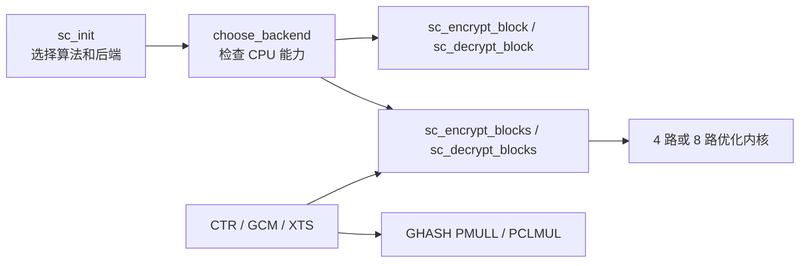

# 课程任务内容与代码实现位置对照

本文回答一个具体问题：课程任务中的每一项要求，分别在本项目的什么文件、什么函数中实现，又由什么测试和实验验证。

项目根目录为 `symmetric_cipher/`。文中的路径均相对于该目录。

## 1. 原始任务逐句对应

原始任务可以拆成四部分：

> 对称密码算法的软件实现  
> 从基本实现出发  
> 优化对称密码（SM4／AES／GIFT／TWINE）的软件执行效率，至少覆盖 T-table、shuffle 以及最新指令集中的两种方法  
> 基于加解密软件实现，做 CTR／GCM／XTS 工作模式的软件优化实现

对应关系如下。

| 任务原文 | 工程中的实现入口 | 完成情况 |
|---|---|---|
| 对称密码算法的软件实现 | `src/aes.c`、`src/sm4.c`、`src/gift64.c`、`src/twine.c` | AES-128/192/256、SM4-128、GIFT-64/128、TWINE-80/128 均有加密和解密 |
| 从基本实现出发 | 各算法的 `*_ref` 或单块轮函数，以及统一 API `sc_encrypt_block`/`sc_decrypt_block` | 参考路径作为所有优化后端的正确性基线 |
| 优化软件执行效率 | `src/dispatch.c` 的批量分派和各 ARM64/x86 内核 | 不再把所有批量请求统一退化为单块循环 |
| T-table | `src/aes.c`、`src/sm4.c` | AES 加/解密四表；SM4 4 KiB、1 KiB、2 KiB 三种表布局 |
| shuffle | `src/arm64/shuffle_arm64.c`、`src/x86/shuffle_x86.c` | ARM NEON `TBL` 与 x86 SSSE3 `PSHUFB` 的真实多块内核 |
| 最新指令集中的至少两种方法 | AES 指令、无进位乘法、GFNI、专用 SM4 指令，见第 6 节 | 实际覆盖超过两类 |
| CTR 优化 | `sc_ctr_xor`，位于 `src/modes.c` | 四种算法均可用，8 路计数器批处理 |
| GCM 优化 | `sc_gcm_encrypt`/`sc_gcm_decrypt` 和 GHASH 后端 | AES/SM4，批量 CTR、四块 GHASH 聚合、PMULL/PCLMUL |
| XTS 优化 | `sc_xts_encrypt`/`sc_xts_decrypt` | AES/SM4，批量 tweak、IEEE/GB 约定、CTS 和原地处理 |

## 2. 从公开接口到优化内核的调用路径

公开 API 定义在 [`include/symcrypto.h`](include/symcrypto.h)，调用关系如下。



主要位置：

- [`include/symcrypto.h`](include/symcrypto.h)：算法、后端、错误码、XTS 约定和所有公共函数声明。
- [`src/dispatch.c`](src/dispatch.c)：
  - `sc_init`：检查密钥长度并初始化上下文；
  - `choose_backend`：根据显式请求或 `auto` 选择真实可运行后端；
  - `sc_encrypt_block`、`sc_decrypt_block`：单块入口；
  - `sc_encrypt_blocks`、`sc_decrypt_blocks`：批量入口，优先进入 4 路或 8 路内核，余数才安全回退到单块接口；
  - `sc_detect_cpu_features`：运行时 CPU 特征检测和线程安全缓存。
- [`src/internal.h`](src/internal.h)：内部密钥结构、CPU 特征结构以及不同架构内核的函数声明。
- [`src/util.c`](src/util.c)：显式大端 `load/store` 和循环移位，避免未对齐访问及 C 语言未定义行为。

可选择的后端为：

| 后端 | 含义 |
|---|---|
| `auto` | 根据本机能力选择硬件或参考路径 |
| `ref` | 标量参考实现 |
| `ttable-4k` | AES/SM4 四表路径 |
| `ttable-1k` | SM4 单表加旋转 |
| `ttable-2k` | SM4 重叠读取表 |
| `shuffle` | NEON TBL、SSSE3 PSHUFB 或 GIFT bitslice |
| `aes-hw` | AES 硬件指令；SM4 时为 AES 指令辅助映射 |
| `gfni` | x86 GFNI 实现 SM4 S 盒 |
| `sm4-hw` | ARM/Intel 专用 SM4 指令 |

如果显式请求的 ISA 在当前 CPU 不可用，`choose_backend` 返回 `SC_ERR_UNSUPPORTED`，不会把后端名称保留为“硬件”却偷偷执行参考代码。

## 3. 四种算法的基础实现

### 3.1 AES-128/192/256

文件：[`src/aes.c`](src/aes.c)

- `sc_aes_setkey`：支持 128、192、256 bit 密钥扩展。
- `sc_aes_encrypt_ref`：
  - `SubBytes`；
  - `ShiftRows`；
  - `MixColumns`；
  - `AddRoundKey`。
- `sc_aes_decrypt_ref`：
  - `InvShiftRows`；
  - `InvSubBytes`；
  - `InvMixColumns`；
  - 逆序轮密钥。
- `sc_aes_encrypt_ttable`、`sc_aes_decrypt_ttable`：优化表路径。

AES 的 FIPS 197 KAT 在 [`tests/test_symcrypto.c`](tests/test_symcrypto.c) 的 `test_kats` 中验证，三个密钥长度都覆盖。

### 3.2 SM4-128

文件：[`src/sm4.c`](src/sm4.c)

- `sc_sm4_setkey`：32 轮密钥扩展。
- `tau`：四字节 S 盒变换。
- `linear`：数据轮线性层 \(B\oplus(B\lll2)\oplus(B\lll10)\oplus(B\lll18)\oplus(B\lll24)\)。
- `linear_key`：密钥扩展线性层。
- `crypt_ref`：标量加/解密共同轮函数；解密通过逆序使用 32 个轮密钥完成。
- `sc_sm4_encrypt_ref`、`sc_sm4_decrypt_ref`：公开给分派层的参考内核。

GB/T 32907-2016 向量 `012345...3210 → 681edf...4246` 在 `test_kats` 中验证。

### 3.3 GIFT-64/128

文件：[`src/gift64.c`](src/gift64.c)

- `bitslice`、`unbitslice`：在四个独立 64-bit 分组之间建立位切片表示。
- `sbox`、`inv_sbox`：纯布尔网络 S 盒和逆 S 盒，不按秘密值查表。
- `permute`、`inverse_permute`：GIFT 固定位置置换及逆置换。
- `sc_gift_encrypt4`、`sc_gift_decrypt4`：真正同时处理四个独立分组的 28 轮加/解密。
- `sc_gift_encrypt`、`sc_gift_decrypt`：单块接口，复用同一轮函数并只占用 lane 0。

需要注意：这里的 `ref` 是单块调用基线，`shuffle` 后端通过批量 API 才会填满四个 bitslice lane；二者使用相同的已验证布尔轮核心。

### 3.4 TWINE-80/128

文件：[`src/twine.c`](src/twine.c)

- `sc_twine_setkey`：分别处理 80-bit 和 128-bit 密钥调度。
- `unpack`/`pack`：64-bit 分组与 16 个 nibble 状态之间转换。
- `sc_twine_encrypt`：35 轮加末轮。
- `sc_twine_decrypt`：逆轮序和逆置换解密。

TWINE-80 和 TWINE-128 论文向量在 `test_kats` 中验证。

## 4. T-table 优化在哪里

### 4.1 AES 四表

文件：[`src/aes.c`](src/aes.c)

- `te[4][256]`：加密 T 表，将 `SubBytes + ShiftRows + MixColumns` 中的数据路径合并。
- `td[4][256]`：解密 T 表。
- `init_te`：线程安全生成加密和解密表。
- `sc_aes_encrypt_ttable`：四表加密。
- `sc_aes_decrypt_ttable`：四表解密，并使用 `inv_mix_word` 变换中间轮密钥。

后端枚举为 `SC_BACKEND_TTABLE`，由 `src/dispatch.c` 接入单块加/解密。

### 4.2 SM4 三种表布局

文件：[`src/sm4.c`](src/sm4.c)

| 方案 | 后端 | 关键数据/函数 | 实现原理 |
|---|---|---|---|
| 4 KiB 四表 | `SC_BACKEND_TTABLE` | `sm4_t[4][256]`、`round_t` | 四个输入字节分别查不同旋转表后异或 |
| 1 KiB 单表 | `SC_BACKEND_TTABLE_1K` | `sm4_t[0]`、`round_t` | 只查第一张表，再旋转 8/16/24 bit |
| 2 KiB 重叠表 | `SC_BACKEND_TTABLE_2K` | `sm4_overlap[256][8]`、`round_t` | 每项重复保存 8 字节，以偏移 0/3/2/1 读取构造旋转结果 |

`sc_sm4_encrypt_ttable` 执行 32 轮表计算。SM4 解密不需要另一套轮函数：`src/dispatch.c` 的 `sm4_reverse_key` 先反转轮密钥，然后复用同一个批量或单块内核。

表大小和对象大小由 [`scripts/collect_sizes.sh`](scripts/collect_sizes.sh) 采集，结果位于：

- [`results/summary/table_sizes.csv`](results/summary/table_sizes.csv)；
- [`results/summary/object_sizes.csv`](results/summary/object_sizes.csv)。

安全边界：T-table 的索引与秘密数据相关，可能泄露缓存访问模式。本项目保留它是为了课程实验和性能比较，不将其作为默认的生产安全后端。

## 5. Shuffle、bitslice 和多块并行在哪里

### 5.1 ARM NEON TBL

文件：[`src/arm64/shuffle_arm64.c`](src/arm64/shuffle_arm64.c)

- `sc_arm_sm4_encrypt4_shuffle`：
  - 四个 SM4 分组并行；
  - 以固定的 16 行表配合 NEON `TBL` 完成 8-bit S 盒；
  - 访问轨迹与秘密输入无关；
  - 解密由分派层传入逆序轮密钥。
- `sc_arm_twine_crypt4_shuffle`：
  - 四个 TWINE 分组并行；
  - 4-bit S 盒天然适合单条 `TBL`；
  - 参数 `decrypt` 同时支持加密和解密；
  - 轮置换在向量寄存器路径中完成。

### 5.2 x86 SSSE3 PSHUFB

文件：[`src/x86/shuffle_x86.c`](src/x86/shuffle_x86.c)

- `sc_x86_sm4_encrypt4_shuffle`：SSSE3 `PSHUFB` 四块 SM4 S 盒路径。
- `sc_x86_twine_crypt4_shuffle`：四块 TWINE 加/解密 shuffle 路径。
- 函数使用目标 ISA 属性单独编译，只有 CPU 特征检测通过才会被分派层调用。

### 5.3 GIFT 四路 bitslice

文件：[`src/gift64.c`](src/gift64.c)

`sc_gift_encrypt4`/`sc_gift_decrypt4` 把四个独立分组转成四个位平面，以布尔网络执行 S 盒，并通过固定掩码网络执行置换。这一路径由 `SC_BACKEND_SHUFFLE` 选择，虽然不依赖 `TBL/PSHUFB` 指令，但属于相同的常量时间 SIMD/位切片优化类别。

### 5.4 批量分派

文件：[`src/dispatch.c`](src/dispatch.c)

`sc_encrypt_blocks` 和 `sc_decrypt_blocks` 根据算法和后端进入：

- AES：ARM/x86 4 路，x86 VAES 8 路；
- SM4：shuffle/GFNI/AES 辅助 4 路，ARM SM4E 4 路，Intel VSM4 8 路；
- GIFT：bitslice 4 路；
- TWINE：TBL/PSHUFB 4 路。

不足并行宽度的最后 1～3 或 1～7 个分组才调用单块接口，因此批量 API 不是“换了名字的单块循环”。

## 6. 新指令集方法在哪里

任务要求至少覆盖两种新指令方法，本项目覆盖以下四组。

### 6.1 AES 专用指令

ARM 与 x86 的单块/四块代码位于 [`src/arm64/aes_arm64.c`](src/arm64/aes_arm64.c)：

- ARM64 分支：
  - 加密：`AESE`、`AESMC`；
  - 解密：`AESD`、`AESIMC`；
  - `sc_arm_aes_encrypt4`/`sc_arm_aes_decrypt4` 四块并行。
- x86 条件编译分支：
  - 加密：`AESENC`、`AESENCLAST`；
  - 解密：`AESDEC`、`AESDECLAST`、`AESIMC`；
  - 同样提供四块并行。

文件名保留 `aes_arm64.c` 是历史兼容原因，但其中明确包含 `#elif defined(__x86_64__)` 的 AES-NI 实现。

x86 VAES 八块实现位于 [`src/x86/aes_vaes.c`](src/x86/aes_vaes.c)：

- `sc_x86_aes_encrypt8_vaes`；
- `sc_x86_aes_decrypt8_vaes`。

### 6.2 GHASH 无进位乘法指令

- ARM：[`src/arm64/ghash_pmull.c`](src/arm64/ghash_pmull.c) 的 `sc_arm_ghash_mul`，使用 `PMULL`。
- x86：[`src/x86/ghash_pclmul.c`](src/x86/ghash_pclmul.c) 的 `sc_x86_ghash_mul`：
  - `PCLMULQDQ`；
  - 可用时使用 `VPCLMULQDQ`。

二者都完成 GF(\(2^{128}\)) 乘法和 GCM 约简，并由 `src/modes.c` 的 `ghash_mul` 运行时选择。

### 6.3 GFNI 实现 SM4 S 盒

- [`src/x86/gfni_model.c`](src/x86/gfni_model.c)：标量同构映射模型 `sc_sm4_gfni_scalar_model`。
- [`src/x86/sm4_gfni_x86.c`](src/x86/sm4_gfni_x86.c)：
  - `sc_x86_sm4_encrypt_gfni`；
  - `sc_x86_sm4_encrypt4_gfni`；
  - 使用 affine、有限域求逆和 inverse-affine 指令构造 SM4 S 盒。
- [`tests/test_symcrypto.c`](tests/test_symcrypto.c) 的 `test_gfni_model`：穷举 0～255，逐项和标准 SM4 S 盒比较。

### 6.4 专用 SM4 指令

- ARM：[`src/arm64/sm4_hw_arm64.c`](src/arm64/sm4_hw_arm64.c)
  - `sc_arm_sm4_setkey_hw`：`SM4EKEY`；
  - `sc_arm_sm4_encrypt4_hw`：`SM4E` 四块路径。
- Intel：[`src/x86/sm4_hw_x86.c`](src/x86/sm4_hw_x86.c)
  - `sc_x86_sm4_encrypt8_hw`：`VSM4RNDS4` 八块路径；
  - `sc_x86_sm4_key4_hw`：`VSM4KEY4`。

Apple M2 Pro 没有 SM4E，因此本机运行时应返回 `SC_ERR_UNSUPPORTED`/显示 SKIP；代码仍被目标 ISA 编译并检查反汇编。x86 VSM4 同样已有真实加密函数，但吞吐率需要具备该 ISA 的 x86 目标机实测。当前 x86 `sc_init` 使用经过测试的标量密钥扩展生成轮密钥，`sc_x86_sm4_key4_hw` 用于验证 `VSM4KEY4` 的编译与指令生成，尚未接入 `sc_init` 的运行时密钥扩展。

### 6.5 AES 指令辅助 SM4

文件：[`src/sm4_aes_assist.c`](src/sm4_aes_assist.c)

- `init_premap`：构造从 SM4 S 盒输入到 AES 逆 S 盒输入的固定扫描预映射。
- `sc_sm4_encrypt4_aes_assist`：
  - ARM 使用 `AESE`；
  - x86 使用 `AESENC`；
  - 再逆转 AES 指令附带的 `ShiftRows`；
  - 四个 SM4 分组并行。

在 `sc_init(..., SC_SM4_128, SC_BACKEND_AES_HW, ...)` 时进入这一路径。SM4 解密仍通过逆序轮密钥复用相同内核。

## 7. CPU 检测和运行时后端分派

文件：[`src/dispatch.c`](src/dispatch.c)

`detect_cpu_features_uncached` 分平台检测：

- macOS ARM64：`sysctlbyname` 检测 AES、PMULL、SM4；
- Linux ARM64：`getauxval(AT_HWCAP)` 和 `HWCAP_AES/PMULL/SM4`；
- x86：CPUID 检测 AES-NI、SSSE3、AVX2、GFNI、VAES、VPCLMUL、SM4；
- x86 AVX 状态：`XGETBV` 确认操作系统已经保存 XMM/YMM 状态。

`sc_detect_cpu_features` 使用 C11 原子变量缓存结果，避免每个分组或模式批次重复执行系统查询。

`choose_backend` 的主要规则：

1. AES `auto` 优先 AES 硬件指令；
2. SM4 `auto` 优先专用 SM4 指令，其次 AES 指令辅助 SM4；
3. 显式选择 shuffle/GFNI/SM4-HW 时严格检查对应能力；
4. 不支持的显式后端返回 `SC_ERR_UNSUPPORTED`。

## 8. CTR 工作模式优化在哪里

公共接口：`sc_ctr_xor`  
实现文件：[`src/modes.c`](src/modes.c)

实现内容：

- AES、SM4、GIFT、TWINE 全部可用；
- 计数器宽度等于算法分组宽度：
  - AES/SM4 为 128 bit；
  - GIFT/TWINE 为 64 bit；
- `increment_be` 按整个分组大端递增；
- 每批生成最多 8 个连续计数器；
- 调用 `sc_encrypt_blocks`，因此自动复用所选算法的多块优化后端；
- 尾部不足一个分组时只异或实际长度；
- 支持输入输出相同的原地操作；
- 正式写输出前，先在 `probe` 副本中预检所有计数器空间；
- 发生回绕时返回 `SC_ERR_COUNTER_WRAP`，原计数器和输出均不修改。

验证位置：

- `tests/test_symcrypto.c::test_ctr`：NIST AES-CTR 向量和基本回绕；
- `tests/test_symcrypto.c::test_mode_boundaries`：失败不修改输出和计数器；
- `tests/test_openssl_diff.c::test_algorithm`：AES/SM4 CTR 与 OpenSSL 随机差分。

## 9. GCM 工作模式优化在哪里

公共接口：

- `sc_gcm_encrypt`；
- `sc_gcm_decrypt`。

实现文件：[`src/modes.c`](src/modes.c)

实现内容：

- 只接受 128-bit 分组的 AES 和 SM4；
- 96-bit IV 由 `make_j0` 走标准快速路径；
- 其他 IV 先通过 GHASH 生成 \(J_0\)；
- 支持任意长度 AAD、明文/密文和 1～16 字节截断标签；
- CTR 数据路径每批生成最多 8 个 `inc32` 计数器，并调用 `sc_encrypt_blocks`；
- `ghash_bytes` 预计算 \(H^2,H^3,H^4\)，完整数据按四块聚合，尾部回退到单块乘法；
- `ghash_mul` 根据 CPU 能力选择：
  - 标量 GF(\(2^{128}\))；
  - ARM PMULL；
  - x86 PCLMUL/VPCLMUL；
- 解密时由 `gcm_check` 先计算并常量时间比较标签；
- 标签错误返回 `SC_ERR_AUTH` 并清空输出；
- 计数器不足时返回 `SC_ERR_COUNTER_WRAP`。

验证位置：

- `tests/test_symcrypto.c::test_gcm`：
  - NIST AES-GCM 向量；
  - RFC 8998 SM4-GCM 向量；
  - 错误标签和输出清零。
- `tests/test_openssl_diff.c`：
  - AES/SM4 GCM 随机差分；
  - 12 字节与 16 字节 IV 交替测试；
  - AAD 和标签比较。

## 10. XTS 工作模式优化在哪里

公共接口：

- `sc_xts_encrypt`；
- `sc_xts_decrypt`；
- `sc_xts_tweak_from_data_unit`。

实现文件：[`src/modes.c`](src/modes.c)

实现内容：

- 只接受同一算法的两个独立 AES 或 SM4 上下文；
- 拒绝小于 16 字节的数据单元；
- `xts_validate` 检查上下文、算法一致性、分组长度和 tweak 约定；
- `xts_mul_x` 支持：
  - `SC_XTS_IEEE_LE`：IEEE 1619 小端多项式约定；
  - `SC_XTS_GBT_BE`：GB/T 大端约定；
- `sc_xts_tweak_from_data_unit` 按所选约定编码 64-bit 数据单元号；
- 一次生成最多 8 个 tweak；
- 先批量执行 `明文 XOR tweak`，再调用 `sc_encrypt_blocks`/`sc_decrypt_blocks`，最后批量 XOR tweak；
- 非整块尾部执行 ciphertext stealing；
- CTS 阶段先将相关分组和尾部保存到临时数组，再写输出，因此 17/31/63 字节原地加/解密不会覆盖尚未读取的数据。

验证位置：

- `tests/test_symcrypto.c::test_xts_roundtrip`：AES 和 SM4、IEEE/GB、63 字节 CTS；
- `tests/test_symcrypto.c::test_mode_boundaries`：17/31/63 字节原地回归、非法约定；
- `tests/test_openssl_diff.c`：
  - AES-XTS；
  - SM4-XTS；
  - 64 字节整块和 63 字节 CTS 差分。

GIFT-64 与 TWINE 没有套用 GCM/XTS，因为两者为 64-bit 分组，而标准 GCM/XTS 工程接口限定 128-bit 分组；它们只接入 CTR。

## 11. 正确性测试在哪里

### 11.1 项目内部测试

文件：[`tests/test_symcrypto.c`](tests/test_symcrypto.c)

| 测试函数 | 验证内容 |
|---|---|
| `test_kats` | AES、SM4、GIFT、TWINE 官方/论文 KAT；加解密互逆和原地单块 |
| `test_ctr` | AES-CTR 向量、回绕错误 |
| `test_gcm` | AES-GCM、SM4-GCM、认证失败清零 |
| `test_xts_roundtrip` | AES/SM4 XTS、IEEE/GB、CTS、最小长度 |
| `test_random_cross` | 固定种子 SM4 参考与 T-table 随机交叉比较 |
| `test_gfni_model` | GFNI 标量模型穷举全部 256 个 S 盒输入 |
| `test_multiblock_backends` | AES 全密钥长度、SM4 各后端、GIFT/TWINE 的 9 块、非对齐、原地、加密和解密 |
| `test_mode_boundaries` | CTR 失败原子性、17/31/63 字节 XTS 原地 CTS、非法约定 |

当前完整测试输出为 `PASS: 1592 checks`。

### 11.2 OpenSSL 差分

文件：[`tests/test_openssl_diff.c`](tests/test_openssl_diff.c)

- 固定 PRNG 状态生成可重复随机输入；
- AES-128 和 SM4 分别循环 40 轮；
- 比较 ECB、CTR、GCM、XTS；
- GCM 覆盖 96-bit 和非 96-bit IV；
- XTS 覆盖整块和 CTS；
- SM4-XTS 按 OpenSSL 的 GB tweak 约定比较。

当前输出为 `PASS: 3360 OpenSSL 3.6 differential checks`。

### 11.3 内存和未定义行为检查

[`Makefile`](Makefile) 的 `test-sanitize`：

- AddressSanitizer；
- UndefinedBehaviorSanitizer；
- `-Wall -Wextra -Wpedantic -Werror`；
- 在消毒器构建上重新运行全部内部测试。

## 12. 指令是否真正生成，在哪里检查

脚本：[`scripts/check_x86.sh`](scripts/check_x86.sh)

该脚本分两层检查：

1. 对实际运行后端对象反汇编，确认 AESENC/AESDEC、VAESENC/VAESDEC、运行时 `PSHUFB`、GFNI、PCLMUL/VPCLMUL、VSM4RNDS4/VSM4KEY4、ARM AESE/AESD/TBL/SM4E/SM4EKEY；
2. 用独立 ISA 探针补充确认编译器能够生成 `VPSHUFB` 和 ARM `PMULL`。

覆盖的指令包括：

- AESENC/AESDEC；
- VAESENC/VAESDEC；
- PSHUFB，以及编译器探针中的 VPSHUFB；
- GFNI；
- PCLMUL/VPCLMUL；
- VSM4RNDS4/VSM4KEY4；
- ARM AESE/AESD/TBL/SM4E/SM4EKEY；
- PMULL 指令见证；实际 GHASH-PMULL 函数位于 `src/arm64/ghash_pmull.c`。

x86 部分在当前 ARM 主机上完成交叉编译和反汇编。状态记录在
[`results/summary/x86_status.json`](results/summary/x86_status.json)。由于没有对应 x86 目标机，项目不填写伪造的 x86 吞吐率和 cycles/byte。

## 13. 性能基准在哪里

基准程序：[`bench/bench.c`](bench/bench.c)

覆盖操作：

- `block`、`block-dec`；
- `ctr`；
- `gcm`、`gcm-dec`；
- `xts`、`xts-dec`；
- SM4 的 `xts-ieee`、`xts-gb`、`xts-gb-dec`。

覆盖长度：

- 64 B；
- 512 B；
- 4 KiB；
- 8 KiB；
- 64 KiB；
- 1 MiB。

实验规则：

- 预热 3 次；
- 正式采样 15 次；
- 密钥扩展不计入稳态吞吐；
- 输出 median、IQR、GB/s、ns/byte；
- 用校验和防止编译器消除计算。

结果文件：

- [`results/raw/native_samples.csv`](results/raw/native_samples.csv)：2610 条原始样本；
- [`results/summary/native_summary.json`](results/summary/native_summary.json)：174 条汇总记录；
- [`results/summary/table_sizes.csv`](results/summary/table_sizes.csv)：表大小；
- [`results/summary/object_sizes.csv`](results/summary/object_sizes.csv)：目标文件代码/数据大小。

结果处理：

- [`scripts/plot_results.py`](scripts/plot_results.py)：生成性能图；
- [`scripts/generate_report_data.py`](scripts/generate_report_data.py)：从 JSON 生成报告表格，避免手工抄写数字；
- [`scripts/collect_sizes.sh`](scripts/collect_sizes.sh)：采集对象和表尺寸。

## 14. PPT 材料、报告和最终交付在哪里

- 原始材料副本：[`materials/对称密码的软件实现与优化.pptx`](materials/对称密码的软件实现与优化.pptx)。
- 86 页逐页映射：[`materials/SLIDE_MAP.md`](materials/SLIDE_MAP.md)。
- 中文 LaTeX 源文件：[`report/report.tex`](report/report.tex)。
- 报告构建脚本：[`scripts/build_report.sh`](scripts/build_report.sh)。
- 最终 PDF：[`output/pdf/symmetric_cipher_software_optimization.pdf`](output/pdf/symmetric_cipher_software_optimization.pdf)。

报告中的性能表由 `native_summary.json` 生成，图由同一结果文件生成，因此每个数字都可以追溯到原始 CSV。

## 15. 一键复现入口

所有入口位于 [`Makefile`](Makefile)：

```sh
make test            # 内部测试 + OpenSSL 差分
make test-sanitize   # ASan + UBSan
make check-x86       # x86 交叉编译和 ARM/x86 指令反汇编检查
make bench           # 重跑基准并生成 CSV/JSON
make report          # 重新生成图表、表格和最终 PDF
make all             # 顺序执行上述全部验收
```

## 16. 平台边界与答辩时应如何表述

可以明确表述为：

1. Apple M2 Pro 已原生运行参考、T-table、NEON TBL、AES 指令辅助 SM4、AESE/AESD 和 PMULL 路径。
2. ARM SM4E/SM4EKEY 与 Intel VSM4 已写入真实后端并通过编译/反汇编检查；M2 Pro 不支持 SM4E，因此按设计跳过运行。
3. x86 AES-NI/VAES、PSHUFB、GFNI、PCLMUL/VPCLMUL、VSM4 的实际函数均能生成目标指令；VPSHUFB 目前是 ISA 编译探针，实际 shuffle 内核使用 128-bit PSHUFB。本项目没有 x86 真机，所以不报告 x86 性能数据。
4. T-table 是课程对比后端，存在秘密相关缓存访问风险；shuffle、bitslice 和硬件指令路径更适合讨论常量时间实现。
5. 本项目是教学和实验代码，不是经过密码认证或侧信道认证的生产密码库。

这样既完整覆盖任务，也不会把“成功生成目标指令”夸大为“已经在不存在的目标硬件上完成性能实测”。
